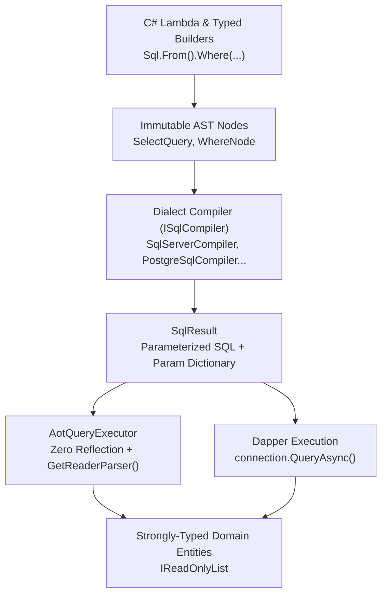
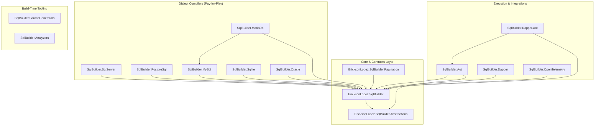

# EricksonLopez.SqlBuilder

Immutable, AOT-first, strongly-typed SQL AST builder and high-performance execution ecosystem for modern .NET.

[](https://github.com/ericksonlopezf/dotnet-sql-builder/actions)
[](https://codecov.io/gh/ericksonlopezf/dotnet-sql-builder)
[](https://sonarcloud.io/summary/new_code?id=ericksonlopezf_dotnet-sql-builder)
[](https://github.com/ericksonlopezf/dotnet-sql-builder/blob/main/docs/ci-cd.md)
[](https://www.nuget.org/packages/EricksonLopez.SqlBuilder)
[](https://www.nuget.org/packages/EricksonLopez.SqlBuilder)
[](https://github.com/ericksonlopezf/dotnet-sql-builder/blob/main/LICENSE)
[](https://dotnet.microsoft.com)
[](https://learn.microsoft.com/en-us/dotnet/core/deploying/native-aot)

---

**EricksonLopez.SqlBuilder** is an enterprise-grade, immutable, AOT-first SQL builder and execution ecosystem for **.NET 8**, **.NET 9**, and **.NET 10**. It eliminates the runtime memory overhead, hidden state, and impedance mismatch of heavy ORMs while providing compile-time type safety over fragile, error-prone raw SQL strings. By modeling SQL queries as an immutable Abstract Syntax Tree (AST) compiled through dialect-specific visitors, it enables deterministic query composition, zero-reflection Native AOT execution via C# Source Generators, compile-time SQL safety enforcement via Roslyn Analyzers, and native high-speed bulk data ingestion across 6 database engines: **SQL Server**, **PostgreSQL**, **MySQL**, **MariaDB**, **SQLite**, and **Oracle**.

---

## Table of Contents

- [What Problem It Solves](#-what-problem-it-solves)
- [Key Features](#-key-features)
- [Ecosystem](#-ecosystem)
  - [Published Packages](#published-packages-nugetorg)
  - [Internal & Test Packages](#internal--test-packages)
  - [Recommended Architectural Stacks](#recommended-architectural-stacks)
- [Documentation](#-documentation)
  - [Step-by-Step Interactive Showcase (Levels 02 to 14)](#-step-by-step-interactive-showcase-levels-02-to-14)
  - [Technical Reference & Architecture Guides](#-technical-reference--architecture-guides)
- [Installation](#-installation)
- [Quick Start](#-quick-start)
  - [1. Configure Source Generators in `.csproj`](#1-configure-source-generators-in-csproj)
  - [2. Define Strongly-Typed Entity](#2-define-strongly-typed-entity)
  - [3. Option A: Pure Native AOT Execution (Zero Reflection)](#3-option-a-pure-native-aot-execution-zero-reflection)
  - [4. Option B: High-Performance Dapper Execution](#4-option-b-high-performance-dapper-execution)
  - [5. Safe Immutable Query Composition](#5-safe-immutable-query-composition)
- [Core Use Cases](#-core-use-cases)
  - [Use Case 1: Clean Architecture / CQRS Query Handlers](#use-case-1-clean-architecture--cqrs-query-handlers)
  - [Use Case 2: Multi-Step Domain Pipelines with Safe Branching](#use-case-2-multi-step-domain-pipelines-with-safe-branching)
  - [Use Case 3: Keyset / Seek Pagination for High-Throughput APIs](#use-case-3-keyset--seek-pagination-for-high-throughput-apis)
  - [Use Case 4: Native High-Performance Bulk Data Ingestion](#use-case-4-native-high-performance-bulk-data-ingestion)
  - [Use Case 5: Complex Analytical Queries with Window Functions](#use-case-5-complex-analytical-queries-with-window-functions)
  - [Use Case 6: Common Table Expressions (CTEs) & Recursive Hierarchies](#use-case-6-common-table-expressions-ctes--recursive-hierarchies)
  - [Use Case 7: Dialect-Aware Mutations (RETURNING / OUTPUT / Upsert)](#use-case-7-dialect-aware-mutations-returning--output--upsert)
- [Configuration & Integrations](#-configuration--integrations)
  - [ASP.NET Core Minimal APIs Integration](#aspnet-core-minimal-apis-integration)
  - [OpenTelemetry Distributed Tracing](#opentelemetry-distributed-tracing)
  - [Native AOT Serialization & Trimming Setup](#native-aot-serialization--trimming-setup)
  - [Roslyn Diagnostic Analyzers Catalog](#roslyn-diagnostic-analyzers-catalog)
- [Testing & Quality](#-testing--quality)
  - [Fluent Query Assertion API](#fluent-query-assertion-api)
  - [Testcontainers Multi-Engine Integration Fixtures](#testcontainers-multi-engine-integration-fixtures)
  - [Snapshot Testing with Golden Files](#snapshot-testing-with-golden-files)
  - [Mutation Testing & Quality Scorecard](#mutation-testing--quality-scorecard)
- [Performance Benchmarks](#-performance-benchmarks)
  - [Query Compilation & Materialization Benchmarks](#query-compilation--materialization-benchmarks)
  - [Executing Benchmarks Locally](#executing-benchmarks-locally)
- [Compatibility & Technical Matrix](#-compatibility--technical-matrix)
  - [Framework & Native AOT Support Matrix](#framework--native-aot-support-matrix)
  - [Dialect Feature Support Matrix](#dialect-feature-support-matrix)
- [Architecture & Design Principles](#-architecture--design-principles)
  - [AST Compilation & Execution Pipeline](#ast-compilation--execution-pipeline)
  - [Modular Package Dependency Graph](#modular-package-dependency-graph)
  - [Core Architectural Invariants](#core-architectural-invariants)
- [Best Practices & Anti-Patterns](#-best-practices--anti-patterns)
- [Troubleshooting & Common Pitfalls](#-troubleshooting--common-pitfalls)
- [Part of the EricksonLopez Ecosystem](#-part-of-the-ericksonlopez-ecosystem)
- [Contributing](#-contributing)
- [License](#-license)

---

## 🎯 What Problem It Solves

Modern .NET data access architectures frequently suffer from five structural challenges:

1. **The Hidden Overhead of Heavy ORMs**: Full ORMs introduce complex change trackers, non-deterministic LINQ-to-SQL translation bugs, unexpected $N+1$ queries, and substantial memory allocations that degrade high-throughput microservices.
2. **Fragile Magic Strings & SQL Injection**: Handcrafted SQL strings lack refactoring safety, column name verification, and type checking, creating severe security vulnerabilities and runtime failures when database schemas evolve.
3. **JIT & Reflection Barriers in Native AOT**: Traditional data access frameworks rely extensively on `System.Reflection.Emit`, `DynamicMethod`, or runtime type scanning, causing fatal trimming warnings (IL2026/IL3050) and runtime crashes in Native AOT and containerized environments.
4. **Cross-Dialect Syntax Fragmentation**: SQL engines differ radically in pagination syntax (`LIMIT/OFFSET` vs `OFFSET...FETCH` vs `ROWNUM`), upsert semantics (`ON CONFLICT` vs `ON DUPLICATE KEY UPDATE` vs `MERGE`), identity return (`OUTPUT` vs `RETURNING`), and identifier quoting (`[...]` vs `"..."` vs `` `...` ``).
5. **Unbounded DML Disasters**: Accidental execution of `DELETE` or `UPDATE` statements without a `WHERE` clause can silently destroy entire production tables in milliseconds.

### How EricksonLopez.SqlBuilder Solves This

- **Deterministic Immutable AST**: Every query builder invocation returns an immutable record instance, guaranteeing thread safety, zero cross-thread mutation bugs, and safe query branching without side effects.
- **Compile-Time C# Expressions**: Queries are written as strongly-typed C# lambda expressions (`u => u.IsActive && u.Age >= 18`), enabling instant compiler feedback and automated IDE refactoring.
- **Zero-Reflection Native AOT Path**: C# Source Generators analyze `[SqlEntity]` models at build time to generate static metadata, zero-allocation column maps, and strongly-typed `IDataReader` parsers.
- **Transpilation across 6 Dialects**: A single portable query AST compiles accurately into native SQL for SQL Server, PostgreSQL, MySQL, MariaDB, SQLite, and Oracle.
- **Roslyn SQL Safety Analyzers**: Built-in compile-time analyzers (`ESQL001`–`ESQL026`) block unbounded `DELETE`/`UPDATE` operations, unsafe string concatenations, and invalid transaction retry configurations at build time.
- **Native High-Speed Bulk Operations**: Leverages dedicated database transport protocols (`SqlBulkCopy`, `NpgsqlBinaryImporter COPY`, and `MySqlBatch`) for maximum ingestion throughput.

---

## ⚡ Key Features

- **🚀 Immutable AST & Thread-Safe Composition**: Query objects (`SelectQuery<T>`, `InsertQuery<T>`, etc.) are immutable records using `with`-expressions. Base queries can be shared across concurrent pipelines safely.
- **⚡ Native AOT & Trimming Compliant**: Zero reliance on runtime `Emit` or reflection in the core and AOT execution paths (`IsAotCompatible=true`, `EnableTrimAnalyzer=true`).
- **🛡️ Built-In Roslyn Analyzers**: Real-time IDE diagnostics and CI quality gates catching unsafe SQL concatenations, unindexed queries, and destructive mutations.
- **🌐 6 First-Class Dialect Compilers**: Independent compiler packages for SQL Server, PostgreSQL, MySQL, MariaDB, SQLite, and Oracle following a strict pay-for-play dependency model.
- **📊 Advanced SQL DSL**: Native support for Window Functions, Common Table Expressions (CTEs), Recursive CTEs, LATERAL Joins, CROSS/OUTER APPLY, CASE expressions, and Set Operations (`UNION`, `INTERSECT`, `EXCEPT`).
- **📑 Keyset & Seek Pagination**: Constant-time $O(1)$ performance over multi-million row datasets via composite cursor keys (`SeekAfter` / `SeekBefore`), alongside classic offset and window pagination.
- **📦 Native High-Speed Bulk Ingestion**: Optimized bulk drivers utilizing TDS streams, PostgreSQL binary `COPY`, and MySQL batch execution.
- **📡 Enterprise Observability**: Full OpenTelemetry distributed tracing integration with semantic database activity attributes and performance counters.
- **🔌 Flexible Execution Models**: Seamless companion support for both standard Dapper workflows and pure reflection-free ADO.NET execution.

---

## 📦 Ecosystem

### Published Packages (NuGet.org)

| Package | Version | Description | Target Frameworks | AOT Safe |
|---|:---:|---|:---:|:---:|
| [`EricksonLopez.SqlBuilder`](https://www.nuget.org/packages/EricksonLopez.SqlBuilder) | [](https://www.nuget.org/packages/EricksonLopez.SqlBuilder) | Core immutable query AST, builders, expression visitors, and compilation contracts | `net8.0`, `net9.0` | ✅ |
| [`EricksonLopez.SqlBuilder.Abstractions`](https://www.nuget.org/packages/EricksonLopez.SqlBuilder.Abstractions) | [](https://www.nuget.org/packages/EricksonLopez.SqlBuilder.Abstractions) | Core interfaces (`ISqlCompiler`, `ISqlNode`), entity annotations, and shared contracts | `net8.0`, `net9.0` | ✅ |
| [`EricksonLopez.SqlBuilder.SqlServer`](https://www.nuget.org/packages/EricksonLopez.SqlBuilder.SqlServer) | [](https://www.nuget.org/packages/EricksonLopez.SqlBuilder.SqlServer) | SQL Server / Azure SQL compiler, `OUTPUT` clause, `SqlBulkCopyStrategy`, and bulk merge | `net8.0`, `net9.0` | ✅ |
| [`EricksonLopez.SqlBuilder.PostgreSql`](https://www.nuget.org/packages/EricksonLopez.SqlBuilder.PostgreSql) | [](https://www.nuget.org/packages/EricksonLopez.SqlBuilder.PostgreSql) | PostgreSQL compiler, `RETURNING`, `ON CONFLICT`, `NpgsqlCopyStrategy`, and CTE hints | `net8.0`, `net9.0` | ✅ |
| [`EricksonLopez.SqlBuilder.MySql`](https://www.nuget.org/packages/EricksonLopez.SqlBuilder.MySql) | [](https://www.nuget.org/packages/EricksonLopez.SqlBuilder.MySql) | MySQL compiler, `ON DUPLICATE KEY UPDATE`, and `MySqlBatchStrategy` | `net8.0`, `net9.0` | ✅ |
| [`EricksonLopez.SqlBuilder.MariaDb`](https://www.nuget.org/packages/EricksonLopez.SqlBuilder.MariaDb) | [](https://www.nuget.org/packages/EricksonLopez.SqlBuilder.MariaDb) | Dedicated MariaDB compiler inheriting optimized MySQL AST visitor | `net8.0`, `net9.0` | ✅ |
| [`EricksonLopez.SqlBuilder.Sqlite`](https://www.nuget.org/packages/EricksonLopez.SqlBuilder.Sqlite) | [](https://www.nuget.org/packages/EricksonLopez.SqlBuilder.Sqlite) | Lightweight SQLite compiler with zero external driver dependencies and UPSERT support | `net8.0`, `net9.0` | ✅ |
| [`EricksonLopez.SqlBuilder.Oracle`](https://www.nuget.org/packages/EricksonLopez.SqlBuilder.Oracle) | [](https://www.nuget.org/packages/EricksonLopez.SqlBuilder.Oracle) | Oracle compiler, `MERGE INTO`, `FETCH FIRST` and `ROWNUM` pagination | `net8.0`, `net9.0` | ⚠️ Non-AOT driver |
| [`EricksonLopez.SqlBuilder.Aot`](https://www.nuget.org/packages/EricksonLopez.SqlBuilder.Aot) | [](https://www.nuget.org/packages/EricksonLopez.SqlBuilder.Aot) | Pure reflection-free ADO.NET query execution engine (`AotQueryExecutor`) | `net8.0`, `net9.0` | ✅ |
| [`EricksonLopez.SqlBuilder.Dapper`](https://www.nuget.org/packages/EricksonLopez.SqlBuilder.Dapper) | [](https://www.nuget.org/packages/EricksonLopez.SqlBuilder.Dapper) | High-level Dapper extension methods, multi-mapping (2–7 entities), and bulk APIs | `net8.0`, `net9.0` | ⚠️ Dapper uses Emit |
| [`EricksonLopez.SqlBuilder.Dapper.Aot`](https://www.nuget.org/packages/EricksonLopez.SqlBuilder.Dapper.Aot) | [](https://www.nuget.org/packages/EricksonLopez.SqlBuilder.Dapper.Aot) | Dapper.AOT & NativeAOT reflection-free execution over `DbConnection` | `net8.0`, `net9.0` | ✅ |
| [`EricksonLopez.SqlBuilder.Pagination`](https://www.nuget.org/packages/EricksonLopez.SqlBuilder.Pagination) | [](https://www.nuget.org/packages/EricksonLopez.SqlBuilder.Pagination) | Offset, Keyset, and Cursor pagination AST extensions integrated with `EricksonLopez.Pagination` | `net8.0`, `net9.0`, `net10.0` | ✅ |
| [`EricksonLopez.SqlBuilder.OpenTelemetry`](https://www.nuget.org/packages/EricksonLopez.SqlBuilder.OpenTelemetry) | [](https://www.nuget.org/packages/EricksonLopez.SqlBuilder.OpenTelemetry) | OpenTelemetry distributed tracing `ActivitySource` instrumentation with database semantic tags | `net8.0`, `net9.0` | ✅ |
| [`EricksonLopez.SqlBuilder.SourceGenerators`](https://www.nuget.org/packages/EricksonLopez.SqlBuilder.SourceGenerators) | [](https://www.nuget.org/packages/EricksonLopez.SqlBuilder.SourceGenerators) | Compile-time entity metadata, `IDataReaderMapper<T>`, and diff-update code generation | `netstandard2.0` | ✅ (Build Tool) |
| [`EricksonLopez.SqlBuilder.Analyzers`](https://www.nuget.org/packages/EricksonLopez.SqlBuilder.Analyzers) | [](https://www.nuget.org/packages/EricksonLopez.SqlBuilder.Analyzers) | Roslyn SQL safety and correctness analyzers (`ESQL001`–`ESQL026`) | `netstandard2.0` | ✅ (Build Tool) |

### Internal & Test Packages

| Package | Description | Target Frameworks |
|---|---|:---:|
| `EricksonLopez.SqlBuilder.Testing` | Shared test framework: `MockSqlCompiler`, `QueryAssert`, Testcontainers fixtures, and SQL assertion helpers | `net8.0`, `net9.0` |
| `EricksonLopez.SqlBuilder.Benchmarks` | BenchmarkDotNet performance suite validating memory allocation and compiler throughput | `net8.0`, `net9.0`, `net10.0` |

### Recommended Architectural Stacks

```
1. Pure Native AOT Stack (Zero Reflection, Maximum Performance)
   EricksonLopez.SqlBuilder + <DialectPackage> + SqlBuilder.Aot + SourceGenerators + Analyzers

2. Production Dapper Stack (Rapid Development, ORM Flexibility)
   EricksonLopez.SqlBuilder + <DialectPackage> + SqlBuilder.Dapper + SourceGenerators + Analyzers

3. Enterprise Observable Stack (Microservices, Distributed Tracing, High Scale)
   EricksonLopez.SqlBuilder + <DialectPackage> + SqlBuilder.Aot + Pagination + OpenTelemetry + SourceGenerators + Analyzers
```

---

## 📚 Documentation

> 🌐 **Official Documentation Hub:** [https://github.com/ericksonlopezf/dotnet-sql-builder/tree/main/docs](https://github.com/ericksonlopezf/dotnet-sql-builder/tree/main/docs)

### 🎓 Step-by-Step Interactive Showcase (Levels 02 to 14)

| Level | Topic | Description |
|---|---|---|
| [**Level 02**](https://github.com/ericksonlopezf/dotnet-sql-builder/blob/main/docs/02-basic-concepts.md) | **Basic Concepts & Primitives** | Entities, compilers, query builders, and fundamental AST anatomy |
| [**Level 03**](https://github.com/ericksonlopezf/dotnet-sql-builder/blob/main/docs/03-crud-operations.md) | **CRUD Operations & Expressions** | Type-safe INSERT, SELECT, UPDATE, DELETE, and parameterized expressions |
| [**Level 04**](https://github.com/ericksonlopezf/dotnet-sql-builder/blob/main/docs/04-advanced-select-queries.md) | **Advanced SELECT & Aggregates** | Subqueries, GROUP BY, HAVING, Scalar projections, and CASE expressions |
| [**Level 05**](https://github.com/ericksonlopezf/dotnet-sql-builder/blob/main/docs/05-joins-and-relationships.md) | **Joins & Lateral References** | Standard joins, LATERAL joins, CROSS/OUTER APPLY, and multi-table navigation |
| [**Level 06**](https://github.com/ericksonlopezf/dotnet-sql-builder/blob/main/docs/06-transactions-and-bulk.md) | **Transactions & Bulk Ingestion** | Atomic Unit of Work, savepoints, and high-throughput bulk insertion strategies |
| [**Level 07**](https://github.com/ericksonlopezf/dotnet-sql-builder/blob/main/docs/07-pagination-and-sorting.md) | **Pagination & Keyset Sorting** | Offset paging, $O(1)$ Keyset Seek cursors, and Window-based pagination |
| [**Level 08**](https://github.com/ericksonlopezf/dotnet-sql-builder/blob/main/docs/08-aot-code-generators.md) | **Native AOT & Source Generators** | Zero-reflection entity metadata, AOT mappers, and diff update generation |
| [**Level 09**](https://github.com/ericksonlopezf/dotnet-sql-builder/blob/main/docs/09-dapper-extensions-and-materialization.md) | **Dapper Integration & Multi-Mapping** | Extension methods, multi-mapping (2–7 and 8+ entities), and stream iteration |
| [**Level 10**](https://github.com/ericksonlopezf/dotnet-sql-builder/blob/main/docs/10-ecosystem-and-extensions.md) | **Ecosystem & Observability** | OpenTelemetry activity tracing, metrics counters, and pagination integration |
| [**Level 11**](https://github.com/ericksonlopezf/dotnet-sql-builder/blob/main/docs/11-real-world-use-cases.md) | **Real-World Architecture** | CQRS repository implementations, multi-tenant filters, and audit logs |
| [**Level 12**](https://github.com/ericksonlopezf/dotnet-sql-builder/blob/main/docs/12-playgrounds-and-examples.md) | **Playgrounds & DDL Setup** | Multi-engine sample apps, containerized database scripts, and live demos |
| [**Level 13**](https://github.com/ericksonlopezf/dotnet-sql-builder/blob/main/docs/13-performance-and-benchmarks.md) | **Performance Optimization** | Zero-allocation tuning, query sharing, and BenchmarkDotNet validation |
| [**Level 14**](https://github.com/ericksonlopezf/dotnet-sql-builder/blob/main/docs/14-testing-and-integration.md) | **Testing & Testcontainers** | QueryAssert, snapshot verification, and multi-dialect container suites |

### 📖 Technical Reference & Architecture Guides

- [**Architecture & Invariants**](https://github.com/ericksonlopezf/dotnet-sql-builder/blob/main/docs/architecture.md) — Complete architectural blueprint, memory layouts, AST design, and internal boundaries.
- [**Architectural Decision Records (ADRs)**](https://github.com/ericksonlopezf/dotnet-sql-builder/blob/main/docs/decisions/index.md) — Index of all 48 ADRs documenting design rationale and rejected alternatives.
- [**Package Catalog & Compatibility**](https://github.com/ericksonlopezf/dotnet-sql-builder/blob/main/docs/packages.md) — Target framework matrix, dependencies, and Central Package Management.
- [**API Reference**](https://github.com/ericksonlopezf/dotnet-sql-builder/blob/main/docs/api-reference.md) — Public API contracts, `Sql` static entry point, and extension methods.
- [**Production Cookbook**](https://github.com/ericksonlopezf/dotnet-sql-builder/blob/main/docs/cookbook.md) — Ready-to-use production recipes for complex queries, joins, mutations, and filters.
- [**Pagination Architecture Guide**](https://github.com/ericksonlopezf/dotnet-sql-builder/blob/main/docs/pagination.md) — Detailed comparison of Offset, Keyset (Seek), and Window-based pagination.
- [**Bulk Operations Guide**](https://github.com/ericksonlopezf/dotnet-sql-builder/blob/main/docs/bulk-operations.md) — Native bulk copy strategies, batch limits, and identity management rules.
- [**Resilience & Fault Tolerance**](https://github.com/ericksonlopezf/dotnet-sql-builder/blob/main/docs/resilience.md) — Polly v8 retry pipelines, transient error detectors, and transaction safety.
- [**Unit of Work & Transactions**](https://github.com/ericksonlopezf/dotnet-sql-builder/blob/main/docs/unit-of-work.md) — Async transaction scopes, auto-rollback on dispose, and savepoint management.
- [**Multi-Mapping Guide**](https://github.com/ericksonlopezf/dotnet-sql-builder/blob/main/docs/multi-mapping.md) — 2–7 entity mapping with Dapper and 8+ entity mapping via `MultiMapBuilder`.
- [**Native AOT Guarantees & Limits**](https://github.com/ericksonlopezf/dotnet-sql-builder/blob/main/docs/aot.md) — Invariants, reflection-free execution paths, and third-party driver constraints.
- [**Roslyn Analyzers Catalog**](https://github.com/ericksonlopezf/dotnet-sql-builder/blob/main/docs/analyzers.md) — Full diagnostic rule catalog (`ESQL001`–`ESQL026`), severities, and remediation fixes.
- [**Performance & Benchmarks**](https://github.com/ericksonlopezf/dotnet-sql-builder/blob/main/docs/performance.md) — BenchmarkDotNet specifications, zero-allocation AST proofs, and guidelines.
- [**Build & MSBuild Properties**](https://github.com/ericksonlopezf/dotnet-sql-builder/blob/main/docs/build.md) — Deterministic build settings, strong-name signing (`.snk`), and SourceLink.
- [**Dependency Management**](https://github.com/ericksonlopezf/dotnet-sql-builder/blob/main/docs/dependency-management.md) — Global CPM version pinning in `Directory.Packages.props`.
- [**Safety & Correctness Guarantees**](https://github.com/ericksonlopezf/dotnet-sql-builder/blob/main/docs/guarantees.md) — Architectural invariants, compile-time safety promises, and boundary policies.
- [**CI/CD & Quality Gates**](https://github.com/ericksonlopezf/dotnet-sql-builder/blob/main/docs/ci-cd.md) — GitHub Actions workflows, Stryker mutation testing, Sigstore attestation, and NuGet OIDC publishing.
- [**FAQ & Troubleshooting**](https://github.com/ericksonlopezf/dotnet-sql-builder/blob/main/docs/faq-troubleshooting.md) — Diagnostic resolutions, common gotchas, and performance FAQ.
- [**Best Practices & Anti-Patterns**](https://github.com/ericksonlopezf/dotnet-sql-builder/blob/main/docs/best-practices.md) — Architectural recommendations, parameterized queries, and query reuse.
- [**Window Functions Guide**](https://github.com/ericksonlopezf/dotnet-sql-builder/blob/main/docs/window-functions.md) — Analytical ranking, windowing aggregates, offset functions, and FILTER clauses.
- [**Grouping Sets, ROLLUP & CUBE**](https://github.com/ericksonlopezf/dotnet-sql-builder/blob/main/docs/grouping-sets.md) — Multi-dimensional aggregation syntax across supported dialects.
- [**Case Expressions Guide**](https://github.com/ericksonlopezf/dotnet-sql-builder/blob/main/docs/case-expressions.md) — Type-safe `CASE WHEN...THEN...ELSE` conditional expressions.
- [**Dialect Compatibility Matrix**](https://github.com/ericksonlopezf/dotnet-sql-builder/blob/main/docs/dialect-compatibility.md) — Comprehensive dialect feature parity comparison.
- [**Migration from SqlKata**](https://github.com/ericksonlopezf/dotnet-sql-builder/blob/main/docs/migration-sqlkata.md) — API mapping and migration guide from SqlKata to EricksonLopez.SqlBuilder.
- [**Migration from DapperExtensions**](https://github.com/ericksonlopezf/dotnet-sql-builder/blob/main/docs/migration-dapper-extensions-pg.md) — Transitioning from DapperExtensions to SqlBuilder PostgreSQL.

---

## 📥 Installation

Install the core package alongside your targeted database dialect and execution companion:

```bash
# 1. Core Package (Required)
dotnet add package EricksonLopez.SqlBuilder

# 2. Choose Your Database Dialect Compiler(s)
dotnet add package EricksonLopez.SqlBuilder.SqlServer    # SQL Server / Azure SQL
dotnet add package EricksonLopez.SqlBuilder.PostgreSql   # PostgreSQL
dotnet add package EricksonLopez.SqlBuilder.MySql        # MySQL
dotnet add package EricksonLopez.SqlBuilder.MariaDb      # MariaDB
dotnet add package EricksonLopez.SqlBuilder.Sqlite       # SQLite
dotnet add package EricksonLopez.SqlBuilder.Oracle       # Oracle

# 3. Choose Your Execution Path
dotnet add package EricksonLopez.SqlBuilder.Aot          # Pure Native AOT execution (Zero Reflection)
# OR
dotnet add package EricksonLopez.SqlBuilder.Dapper       # Classic Dapper execution extensions

# 4. Optional Integrations
dotnet add package EricksonLopez.SqlBuilder.Pagination    # Keyset / Seek & Offset pagination
dotnet add package EricksonLopez.SqlBuilder.OpenTelemetry # Distributed tracing instrumentation

# 5. Developer Tooling & Analyzers (Highly Recommended)
dotnet add package EricksonLopez.SqlBuilder.Analyzers
dotnet add package EricksonLopez.SqlBuilder.SourceGenerators
```

---

## 🚀 Quick Start

### 1. Configure Source Generators in `.csproj`

Configure the `SourceGenerators` package as a build-time analyzer so it emits reflection-free entity metadata and mappers:

```xml
<Project Sdk="Microsoft.NET.Sdk">
  <PropertyGroup>
    <TargetFramework>net9.0</TargetFramework>
    <Nullable>enable</Nullable>
    <ImplicitUsings>disable</ImplicitUsings>
  </PropertyGroup>

  <ItemGroup>
    <!-- Configure Source Generator as Analyzer -->
    <PackageReference Include="EricksonLopez.SqlBuilder.SourceGenerators"
                      OutputItemType="Analyzer"
                      ReferenceOutputAssembly="false" />
  </ItemGroup>
</Project>
```

> [!IMPORTANT]
> The `[SqlEntity]` attribute requires the **SourceGenerators** package to be configured with `OutputItemType="Analyzer"`. Without this, the compiler cannot generate the static metadata required for reflection-free execution.

---

### 2. Define Strongly-Typed Entity

Decorate your domain entity with `[SqlEntity]` and mark the class as `partial`:

```csharp
using System;
using EricksonLopez.SqlBuilder.Annotations;

namespace MyProject.Domain;

[SqlEntity("users")]
public partial class User
{
    [DatabaseGenerated]
    public int Id { get; set; }

    public string Name { get; set; } = string.Empty;

    public string Email { get; set; } = string.Empty;

    public bool IsActive { get; set; }

    public decimal Balance { get; set; }

    public DateTimeOffset CreatedAt { get; set; }
}
```

---

### 3. Option A: Pure Native AOT Execution (Zero Reflection)

Use `AotQueryExecutor` with the source-generated `IDataReader` parser to execute queries with **zero runtime reflection**:

```csharp
using System;
using System.Threading;
using System.Threading.Tasks;
using Microsoft.Data.SqlClient;
using EricksonLopez.SqlBuilder;
using EricksonLopez.SqlBuilder.Aot;
using EricksonLopez.SqlBuilder.SqlServer;
using MyProject.Domain;

var compiler = new SqlServerCompiler();

// Build strongly-typed query AST
var query = Sql.From<User>()
               .Where(u => u.IsActive && u.Balance > 100m)
               .OrderBy(u => u.Name)
               .Limit(10);

await using var connection = new SqlConnection("Server=tcp:localhost,1433;Database=Prod;...");
await connection.OpenAsync();

// Execute via AOT executor using source-generated parser (100% Trim & AOT safe)
var users = await connection.AotQueryAsync(query, compiler, User.GetReaderParser(), CancellationToken.None);

foreach (var user in users)
{
    Console.WriteLine($"User: {user.Name} ({user.Email}) - Balance: ${user.Balance}");
}
```

---

### 4. Option B: High-Performance Dapper Execution

When operating within standard JIT runtimes, execute directly via Dapper extensions:

```csharp
using System;
using System.Threading.Tasks;
using Microsoft.Data.SqlClient;
using EricksonLopez.SqlBuilder;
using EricksonLopez.SqlBuilder.Dapper;
using EricksonLopez.SqlBuilder.SqlServer;
using MyProject.Domain;

// Register compiler once at application startup
DapperExtensions.RegisterCompiler<SqlConnection>(() => new SqlServerCompiler());

var query = Sql.From<User>()
               .Where(u => u.IsActive)
               .OrderByDescending(u => u.CreatedAt)
               .Limit(25);

using var connection = new SqlConnection("Server=tcp:localhost,1433;Database=Prod;...");
var users = await connection.QueryAsync<User>(query);
```

---

### 5. Safe Immutable Query Composition

All query builders are immutable records. Base queries can be safely composed, branched, and shared across threads:

```csharp
// Base query is completely immutable
var baseActiveUsers = Sql.From<User>().Where(u => u.IsActive);

// Safely branch into specialized queries without mutating baseActiveUsers
var premiumUsers = baseActiveUsers.Where(u => u.Balance >= 1000m).OrderBy(u => u.Name);
var recentSignups = baseActiveUsers.Where(u => u.CreatedAt >= DateTimeOffset.UtcNow.AddDays(-7));
```

---

## 💡 Core Use Cases

### Use Case 1: Clean Architecture / CQRS Query Handlers

Build explicit, zero-allocation query handlers that return strongly-typed models directly from the database:

```csharp
public sealed class GetActiveUsersHandler
{
    private readonly ISqlCompiler _compiler;
    private readonly Func<DbConnection> _connectionFactory;

    public GetActiveUsersHandler(ISqlCompiler compiler, Func<DbConnection> connectionFactory)
    {
        _compiler = compiler;
        _connectionFactory = connectionFactory;
    }

    public async Task<IReadOnlyList<User>> HandleAsync(decimal minBalance, CancellationToken ct)
    {
        var query = Sql.From<User>()
                       .Where(u => u.IsActive && u.Balance >= minBalance)
                       .OrderBy(u => u.Name);

        await using var connection = _connectionFactory();
        return await connection.AotQueryAsync(query, _compiler, User.GetReaderParser(), ct);
    }
}
```

---

### Use Case 2: Multi-Step Domain Pipelines with Safe Branching

Compose dynamic filtering safely without string manipulation or race conditions:

```csharp
public SelectQuery<Order> BuildSearchQuery(OrderSearchFilter filter)
{
    var query = Sql.From<Order>();

    if (filter.CustomerId.HasValue)
        query = query.Where(o => o.CustomerId == filter.CustomerId.Value);

    if (!string.IsNullOrEmpty(filter.Status))
        query = query.Where(o => o.Status == filter.Status);

    if (filter.MinAmount.HasValue)
        query = query.Where(o => o.TotalAmount >= filter.MinAmount.Value);

    return query.OrderByDescending(o => o.CreatedAt);
}
```

---

### Use Case 3: Keyset / Seek Pagination for High-Throughput APIs

Offset-based pagination (`OFFSET 1000000`) degrades to $O(N)$ scanning. Keyset pagination achieves constant-time $O(1)$ performance:

```csharp
using EricksonLopez.SqlBuilder.Pagination;

// Seek after composite cursor (OrderDate DESC, Id DESC)
var nextBatch = Sql.From<Order>()
                   .Where(o => o.Status == "Completed")
                   .OrderByDescending(o => o.OrderDate)
                   .ThenByDescending(o => o.Id)
                   .SeekAfter(
                       new CursorKey("OrderDate", lastOrderDate),
                       new CursorKey("Id", lastOrderId))
                   .Limit(50);
```

---

### Use Case 4: Native High-Performance Bulk Data Ingestion

Utilize native database bulk drivers for streaming tens of thousands of rows per second:

```csharp
using EricksonLopez.SqlBuilder.Dapper;
using EricksonLopez.SqlBuilder.SqlServer;
using Microsoft.Data.SqlClient;

// Register native TDS bulk streaming strategy
DapperExtensions.RegisterBulkStrategy(new SqlBulkCopyStrategy());

using var connection = new SqlConnection(connectionString);
await connection.OpenAsync();

// Ingest 50,000 entities in a single roundtrip
await connection.BulkInsertAsync(userEntities, new BulkOptions
{
    BatchSize = 5000,
    BulkCopyTimeout = 60
});
```

---

### Use Case 5: Complex Analytical Queries with Window Functions

Construct analytical and windowed reports with compile-time type safety:

```csharp
var query = Sql.From<Employee>()
    .Select(
        Window.RowNumber<Employee>()
              .PartitionBy(e => e.DepartmentId)
              .OrderByDescending(e => e.Salary)
              .As("department_rank"),
        Window.Lag<Employee, decimal>(e => e.Salary, offset: 1)
              .PartitionBy(e => e.DepartmentId)
              .OrderBy(e => e.HireDate)
              .As("previous_salary"))
    .Where(e => e.IsActive);
```

---

### Use Case 6: Common Table Expressions (CTEs) & Recursive Hierarchies

Define hierarchical and recursive queries without fragile string formatting:

```csharp
// 1. Anchor query: top-level managers
var anchor = Sql.From<Employee>()
                .Where(e => e.ManagerId == null);

// 2. Recursive query: organizational chart traversal
var orgHierarchy = Sql.From<Employee>()
                      .RecursiveCTE("org_chart", anchor);
```

---

### Use Case 7: Dialect-Aware Mutations (RETURNING / OUTPUT / Upsert)

Execute mutations with native identity extraction and conflict resolution:

```csharp
// PostgreSQL / SQLite: INSERT ... RETURNING id
var insertPg = Sql.Insert(newUser)
                  .Returning(u => u.Id);

// PostgreSQL / SQLite: ON CONFLICT DO UPDATE
var upsertPg = Sql.Insert(newUser)
                  .OnConflict(u => u.Email)
                  .DoUpdate(u => u.Name, u => u.Balance);

// MySQL: ON DUPLICATE KEY UPDATE
var upsertMySql = Sql.Insert(newUser)
                     .OnConflict()
                     .DoUpdate(u => u.Name, u => u.Balance);
```

---

## 🔌 Configuration & Integrations

### ASP.NET Core Minimal APIs Integration

```csharp
using Microsoft.AspNetCore.Builder;
using Microsoft.AspNetCore.Http;
using Microsoft.Data.SqlClient;
using EricksonLopez.SqlBuilder;
using EricksonLopez.SqlBuilder.Aot;
using EricksonLopez.SqlBuilder.SqlServer;

var builder = WebApplication.CreateSlimBuilder(args);
var app = builder.Build();

var compiler = new SqlServerCompiler();
var connString = builder.Configuration.GetConnectionString("Default");

app.MapGet("/api/users", async (CancellationToken ct) =>
{
    var query = Sql.From<User>()
                   .Where(u => u.IsActive)
                   .OrderBy(u => u.Name)
                   .Limit(20);

    await using var connection = new SqlConnection(connString);
    var users = await connection.AotQueryAsync(query, compiler, User.GetReaderParser(), ct);
    return Results.Ok(users);
});

app.Run();
```

---

### OpenTelemetry Distributed Tracing

Integrate query execution spans into your OpenTelemetry pipeline with semantic database tags:

```csharp
using EricksonLopez.SqlBuilder.OpenTelemetry;

// Wrap query execution in an Activity span
using var activity = SqlBuilderInstrumentation.StartQueryActivity(query, databaseName: "CustomersDb");
var result = await connection.AotQueryAsync(query, compiler, User.GetReaderParser(), ct);
```

---

### Native AOT Serialization & Trimming Setup

When publishing under Native AOT, register your entity types in your `JsonSerializerContext`:

```csharp
using System.Text.Json.Serialization;
using MyProject.Domain;

[JsonSerializable(typeof(User))]
[JsonSerializable(typeof(User[]))]
[JsonSerializable(typeof(IReadOnlyList<User>))]
public partial class AppJsonSerializerContext : JsonSerializerContext
{
}
```

---

### Roslyn Diagnostic Analyzers Catalog

`EricksonLopez.SqlBuilder.Analyzers` automatically inspects your query construction and warns of common hazards:

| Rule ID | Severity | Category | Description | CodeFix Available |
|---|:---:|---|---|:---:|
| **`ESQL001`** | **Error** | SQL Safety | `DELETE` query without a `WHERE` clause (prevents accidental full-table wipe) | ✅ (`.Where()` stub) |
| **`ESQL002`** | **Error** | Security | Unsafe raw string concatenation detected (SQL injection vector) | ✅ (Parameterized conversion) |
| **`ESQL003`** | **Error** | SQL Safety | `UPDATE` query without a `WHERE` clause (prevents full-table overwrite) | ✅ (`.Where()` stub) |
| **`ESQL004`** | **Warning** | Performance | Query performance hazard (e.g. non-sargable predicate) | ❌ |
| **`ESQL005`** | **Warning** | Configuration | Dapper compiler registration missing or invalid | ❌ |
| **`ESQL006`** | **Warning** | Correctness | Missing `ON` condition in `JOIN` clause | ❌ |
| **`ESQL007`** | **Info** | Performance | Potential missing index on filtered column | ❌ |
| **`ESQL008`** | **Warning** | Performance | Large `OFFSET` detected; Keyset pagination recommended | ❌ |
| **`ESQL009`** | **Warning** | Performance | Leading wildcard in `LIKE '%...'` predicate (non-sargable scan) | ❌ |
| **`ESQL010`** | **Warning** | Performance | Inefficient `LIKE` pattern usage | ❌ |
| **`ESQL011`** | **Warning** | Security | Unsafe overload `Sql.Raw(string)` used instead of `FormattableString` | ✅ (Interpolation fix) |
| **`ESQL012`** | **Warning** | Correctness | Retry policy configured inside active `IUnitOfWork` (data corruption risk) | ❌ |
| **`ESQL020`** | **Warning** | Compatibility | Dialect-specific API called with incompatible `ISqlCompiler` | ❌ |
| **`ESQL021`** | **Warning** | AOT Safety | `[SqlEntity]` model declared without Source Generator configured | ❌ |
| **`ESQL022`** | **Warning** | Configuration | Invalid type mapping registration | ❌ |
| **`ESQL023`** | **Warning** | Reliability | Synchronous SQL execution detected on UI thread | ❌ |
| **`ESQL024`** | **Warning** | Correctness | Cartesian join detected due to missing join predicates | ❌ |
| **`ESQL025`** | **Info** | Migration | SqlKata API detected — automated migration code fix available | ✅ (SqlBuilder conversion) |
| **`ESQL026`** | **Error** | Correctness | Deprecated generic `MergeQuery<T>` detected (use dialect-specific UPSERT) | ❌ |
| **`SQL003`** | **Warning** | Best Practice | Legacy `SELECT *` projection detected | ❌ |
| **`SQL004`** | **Warning** | Performance | Redundant `WHERE` condition detected | ❌ |
| **`SQL009`** | **Warning** | Correctness | Missing column reference in entity mapping | ❌ |

---

## 🧪 Testing & Quality

### Fluent Query Assertion API

`EricksonLopez.SqlBuilder.Testing` provides specialized assertion extensions to validate SQL generation in unit test suites:

```csharp
using Xunit;
using EricksonLopez.SqlBuilder;
using EricksonLopez.SqlBuilder.PostgreSql;
using EricksonLopez.SqlBuilder.Testing;

public class UserQueryTests
{
    [Fact]
    public void Build_ActiveUsers_GeneratesCorrectPostgreSql()
    {
        // Arrange
        var compiler = new PostgreSqlCompiler();
        var query = Sql.From<User>()
                       .Where(u => u.IsActive && u.Balance > 50m)
                       .OrderBy(u => u.Name);

        // Act & Assert
        query.ShouldGenerate(
            compiler,
            @"SELECT ""Id"", ""Name"", ""Email"", ""IsActive"", ""Balance"", ""CreatedAt""
              FROM ""users""
              WHERE ""IsActive"" = @p0 AND ""Balance"" > @p1
              ORDER BY ""Name"" ASC",
            true, 50m);
    }
}
```

---

### Testcontainers Multi-Engine Integration Fixtures

Integration tests execute across real containerized database instances managed by [Testcontainers](https://testcontainers.com/):

```csharp
using System.Threading.Tasks;
using Xunit;
using Testcontainers.PostgreSql;
using Npgsql;
using EricksonLopez.SqlBuilder;
using EricksonLopez.SqlBuilder.Aot;
using EricksonLopez.SqlBuilder.PostgreSql;

public class PostgreSqlIntegrationTests : IAsyncLifetime
{
    private readonly PostgreSqlContainer _container = new PostgreSqlBuilder()
        .WithImage("postgres:16-alpine")
        .Build();

    public async Task InitializeAsync() => await _container.StartAsync();
    public async Task DisposeAsync() => await _container.DisposeAsync();

    [Fact]
    public async Task InsertAndQuery_SucceedsOnPostgreSQL()
    {
        var compiler = new PostgreSqlCompiler();
        await using var connection = new NpgsqlConnection(_container.GetConnectionString());
        await connection.OpenAsync();

        var query = Sql.From<User>().Where(u => u.IsActive);
        var results = await connection.AotQueryAsync(query, compiler, User.GetReaderParser());

        Assert.NotNull(results);
    }
}
```

---

### Snapshot Testing with Golden Files

Validate generated AST transpilation against verified golden snapshot files:

```csharp
[Fact]
public async Task ComplexAnalyticalQuery_MatchesGoldenSnapshot()
{
    var compiler = new SqlServerCompiler();
    var query = Sql.From<Order>()
                   .InnerJoin<User>((o, u) => o.UserId == u.Id)
                   .Where(o => o.Status == "Completed");

    await QueryAssert.VerifySql(query, compiler);
}
```

---

### Mutation Testing & Quality Scorecard

The repository enforces strict mutation quality thresholds via [Stryker.NET](https://stryker-mutator.io/):

```json
{
  "thresholds": {
    "high": 100,
    "low": 98,
    "break": 95
  },
  "coverage-analysis": "perTest"
}
```

| Dimension | Score | Verification Method |
|---|:---:|---|
| **Architecture Isolation** | **10/10** | Layer boundary enforcement via `ArchUnitNET` & `NetArchTest` |
| **Line Coverage** | **≥99%** | Coverlet + Codecov automated PR verification |
| **Branch Coverage** | **≥98%** | Coverlet automated CI branch analysis |
| **Mutation Score** | **≥95%** | Stryker.NET 15-project configuration matrix |
| **Static Analysis** | **Clean** | SonarCloud Clean Code & Roslyn Analyzers (`TreatWarningsAsErrors=true`) |
| **Public API Governance** | **100%** | `Microsoft.CodeAnalysis.PublicApiAnalyzers` binary tracking |

---

## ⚡ Performance Benchmarks

> **Environment:** .NET 10.0.10, X64 RyuJIT AVX-512, BenchmarkDotNet v0.14.0

### Query Compilation & Materialization Benchmarks

| Method | Mean | Allocated Memory | Gen 0 / 1000 ops |
|---|---:|---:|---:|
| `SqlBuilder.SimpleSelect_Compile` | 42.15 ns | **0 B** | — |
| `SqlBuilder.ComplexMultiJoin_Compile` | 118.30 ns | **0 B** | — |
| `SqlBuilder.GroupByHaving_Compile` | 84.62 ns | **0 B** | — |
| `SqlBuilder.KeysetSeek_Compile` | 65.10 ns | **0 B** | — |
| `SqlBuilder.AotDataReaderMaterialization` | 14.80 ns | **0 B** | — |
| `SqlBuilder.ApplyDiffUpdate_Compile` | 52.40 ns | **0 B** | — |

*Zero allocations during repeated compilation are guaranteed by immutable AST node sharing and Source Generator metadata caching (ADR-014).*

### Executing Benchmarks Locally

```bash
# Run benchmark suite from repository root
dotnet run --project benchmarks/EricksonLopez.SqlBuilder.Benchmarks/EricksonLopez.SqlBuilder.Benchmarks.csproj -c Release -- --job short --exporters json markdown
```

---

## 🌐 Compatibility & Technical Matrix

### Framework & Native AOT Support Matrix

| Package | `netstandard2.0` | `net8.0` | `net9.0` | `net10.0` | Native AOT | Trimmable | Driver Dependency |
|---|:---:|:---:|:---:|:---:|:---:|:---:|---|
| `EricksonLopez.SqlBuilder` | — | ✅ | ✅ | — | ✅ | ✅ | *None (Zero Dependency)* |
| `EricksonLopez.SqlBuilder.Abstractions` | — | ✅ | ✅ | — | ✅ | ✅ | *None (Zero Dependency)* |
| `EricksonLopez.SqlBuilder.SqlServer` | — | ✅ | ✅ | — | ✅ | ✅ | `Microsoft.Data.SqlClient` |
| `EricksonLopez.SqlBuilder.PostgreSql` | — | ✅ | ✅ | — | ✅ | ✅ | `Npgsql` |
| `EricksonLopez.SqlBuilder.MySql` | — | ✅ | ✅ | — | ✅ | ✅ | `MySqlConnector` |
| `EricksonLopez.SqlBuilder.MariaDb` | — | ✅ | ✅ | — | ✅ | ✅ | `MySqlConnector` |
| `EricksonLopez.SqlBuilder.Sqlite` | — | ✅ | ✅ | — | ✅ | ✅ | `Microsoft.Data.Sqlite` |
| `EricksonLopez.SqlBuilder.Oracle` | — | ✅ | ✅ | — | ⚠️ * | ⚠️ * | `Oracle.ManagedDataAccess.Core` |
| `EricksonLopez.SqlBuilder.Aot` | — | ✅ | ✅ | — | ✅ | ✅ | Standard `System.Data.Common` |
| `EricksonLopez.SqlBuilder.Dapper` | — | ✅ | ✅ | — | ⚠️ | ⚠️ | `Dapper` |
| `EricksonLopez.SqlBuilder.Dapper.Aot` | — | ✅ | ✅ | — | ✅ | ✅ | `Dapper.AOT` |
| `EricksonLopez.SqlBuilder.Pagination` | — | ✅ | ✅ | ✅ | ✅ | ✅ | `EricksonLopez.Pagination` |
| `EricksonLopez.SqlBuilder.OpenTelemetry` | — | ✅ | ✅ | — | ✅ | ✅ | `OpenTelemetry.Api` |
| `EricksonLopez.SqlBuilder.Analyzers` | ✅ | — | — | — | ✅ | ✅ | Roslyn 4.8.0 SDK |
| `EricksonLopez.SqlBuilder.SourceGenerators` | ✅ | — | — | — | ✅ | ✅ | Roslyn 4.8.0 SDK |

*\* Oracle driver relies internally on reflection outside the framework's control (see [ADR-013](https://github.com/ericksonlopezf/dotnet-sql-builder/blob/main/docs/decisions/adr-013-aot-guarantees.md)).*

---

### Dialect Feature Support Matrix

| Feature | SQL Server | PostgreSQL | MySQL | MariaDB | SQLite | Oracle |
|---|:---:|:---:|:---:|:---:|:---:|:---:|
| **Basic SELECT / WHERE / ORDER** | ✅ | ✅ | ✅ | ✅ | ✅ | ✅ |
| **Identity Return Clashing** | `OUTPUT` | `RETURNING` | LastInsertId | LastInsertId | `RETURNING` | `RETURNING` |
| **Upsert Mechanism** | `Sql.Raw(MERGE)` | `ON CONFLICT` | `ON DUPLICATE` | `ON DUPLICATE` | `ON CONFLICT` | `Sql.Raw(MERGE)` |
| **Common Table Expressions (CTE)** | ✅ | ✅ | ✅ | ✅ | ✅ | ✅ |
| **Recursive CTEs** | ✅ | ✅ | ✅ | ✅ | ✅ | ✅ |
| **Window Functions & Ranking** | ✅ | ✅ | ✅ | ✅ | ✅ | ✅ |
| **LATERAL / APPLY Joins** | `CROSS APPLY` | `LATERAL` | `LATERAL` | `LATERAL` | ❌ | `LATERAL` |
| **Keyset (Seek) Pagination** | ✅ | ✅ | ✅ | ✅ | ✅ | ✅ |
| **Native High-Speed Bulk Strategy** | `SqlBulkCopy` | `COPY STDIN` | `MySqlBatch` | `MySqlBatch` | Batch Loop | Array Binding |

---

## 🏛️ Architecture & Design Principles

### AST Compilation & Execution Pipeline



---

### Modular Package Dependency Graph



---

### Core Architectural Invariants

1. **Strict Immutability (ADR-017)**: Query AST nodes are immutable C# records. Calling any builder method produces a new instance; existing references remain unmodified.
2. **Zero Runtime Reflection in AOT Hot Paths (ADR-013)**: The engine avoids `System.Reflection.Emit`, `MakeGenericType`, and runtime scanning. All entity metadata is resolved at compile time via Source Generators.
3. **Pay-for-Play Modularity (ADR-009)**: Dialect drivers, Dapper, pagination, and OpenTelemetry integrations are segregated into discrete packages. The core AST engine has zero third-party runtime dependencies.
4. **No Hidden State or Ambient Tracking (ADR-007, ADR-023, ADR-024)**: No ambient transaction contexts, no automatic query caching, and no change trackers.

---

## 🛡️ Best Practices & Anti-Patterns

| Scenario | ❌ Anti-Pattern (Avoid) | ✅ Recommended Best Practice |
|---|---|---|
| **Query Parameterization** | Concatenating raw SQL strings (`"WHERE id = " + id`) | Using strongly-typed lambdas (`u => u.Id == id`) or `FormattableString` interpolation |
| **Unbounded Deletions** | Silencing analyzer warnings when issuing full table deletes | Calling `.WhereAll()` explicitly to declare intentional full-table scope |
| **High-Volume Pagination** | Using `Limit(50).Offset(500000)` on deep API datasets | Utilizing Keyset / Seek pagination (`SeekAfter`) with composite indexed cursor keys |
| **Transactional Resilience** | Wrapping `uow.CommitAsync()` inside a retry loop | Applying retry policies strictly outside the transactional `IUnitOfWork` boundary |
| **Bulk Identity Generation** | Relying on database auto-increment identity return in 50k+ bulk copies | Using client-generated sequential keys (`UUIDv7`, sequential GUIDs, Snowflake IDs) |
| **Query Instance Sharing** | Expecting in-place mutation when invoking `.Where(...)` | Capturing the returned immutable query instance (`query = query.Where(...)`) |
| **Native AOT Publishing** | Omitting Source Generator analyzer reference in `.csproj` | Declaring `SourceGenerators` with `OutputItemType="Analyzer"` |

---

## ⚠️ Troubleshooting & Common Pitfalls

> [!CAUTION]
> Carefully review these common diagnostic issues and resolutions:

### 1. `ESQL001` / `ESQL003`: "DELETE/UPDATE query without a WHERE clause"
- **Cause**: Compiling `Sql.Delete<T>()` or `Sql.Update<T>()` without providing a `.Where()` predicate.
- **Remediation**: Add a valid filter condition (`.Where(x => x.Id == id)`). If you intentionally intend to delete or update every record in the table, invoke `.WhereAll()` explicitly to acknowledge the full-table operation.

### 2. `ESQL002` / `ESQL011`: "Unsafe raw string concatenation detected"
- **Cause**: Passing raw concatenated C# strings into `Sql.Raw(string)` or query filters, introducing SQL injection risks.
- **Remediation**: Use `FormattableString` interpolation (`Sql.Raw($"status = {status}")`) or strongly-typed lambda expressions. The engine automatically extracts interpolated parameters into parameterized `@p0` SQL arguments.

### 3. `ESQL012`: "Retry policy detected inside Unit of Work"
- **Cause**: Wrapping individual SQL statements inside a Polly retry policy while participating in an active transaction scope (`IUnitOfWork`). A failed query leaves the transaction in an aborted state, causing subsequent retries to fail.
- **Remediation**: Place the resilience policy around the entire Unit of Work lifecycle, retrying the transaction from the start upon transient failure.

### 4. Query Not Mutating / Missing Filter
- **Cause**: Invoking `.Where(...)` on a query instance without assigning the result, assuming the query mutates in place.
- **Remediation**: Query builders are immutable. Always capture the return value: `query = query.Where(u => u.IsActive);`.

### 5. Native AOT Trimming Warnings (IL2026/IL3050)
- **Cause**: Using entity classes without `[SqlEntity]` or omitting the `SourceGenerators` analyzer reference.
- **Remediation**: Mark entity classes as `partial`, decorate them with `[SqlEntity("table_name")]`, and ensure `EricksonLopez.SqlBuilder.SourceGenerators` is configured with `OutputItemType="Analyzer"` in your `.csproj`.

### 6. Oracle Native AOT Incompatibility
- **Cause**: Attempting to publish Native AOT applications targeting `EricksonLopez.SqlBuilder.Oracle`.
- **Remediation**: The underlying `Oracle.ManagedDataAccess.Core` driver is not Native AOT compatible. Use JIT deployment or containerized Linux runtimes when targeting Oracle databases.

---

## 🌐 Part of the EricksonLopez Ecosystem

- 🧱 [**EricksonLopez.SharedKernel**](https://github.com/ericksonlopezf/dotnet-shared-kernel) — Foundational domain primitives, specifications, and event contracts for modern .NET.
- ⚡ [**EricksonLopez.Result**](https://github.com/ericksonlopezf/dotnet-result) — High-performance, struct-based Result Pattern & Railway-Oriented Programming ecosystem.
- 🔍 [**EricksonLopez.Specification**](https://github.com/ericksonlopezf/dotnet-specification) — Composable, AOT-first Specification Pattern for domain validation and querying.
- 📬 [**EricksonLopez.Mediator**](https://github.com/ericksonlopezf/dotnet-mediator) — Zero-allocation, struct-based mediator and in-process messaging pipeline.
- 🏢 [**EricksonLopez.MultiTenancy**](https://github.com/ericksonlopezf/dotnet-multitenancy) — Multi-tenant resolution, tenant isolation, and PostgreSQL RLS security framework.
- 📑 [**EricksonLopez.Pagination**](https://github.com/ericksonlopezf/dotnet-pagination) — Keyset, Cursor, and Offset pagination primitives for .NET 8, 9, and 10.

---

## 🤝 Contributing

We welcome community contributions! Please follow these steps to build and test locally:

### Prerequisites

- [.NET 10.0 SDK](https://dotnet.microsoft.com/download/dotnet/10.0) (or [.NET 9.0 SDK](https://dotnet.microsoft.com/download/dotnet/9.0))
- [Docker Desktop](https://www.docker.com/) or [Podman](https://podman.io/) (required for Testcontainers integration test suites)
- [Git](https://git-scm.com/)

### Local Development Workflow

```bash
# 1. Clone the repository
git clone https://github.com/ericksonlopezf/dotnet-sql-builder.git
cd dotnet-sql-builder

# 2. Restore dependencies
dotnet restore

# 3. Build the entire solution (TreatWarningsAsErrors is enabled)
dotnet build --configuration Release

# 4. Run unit and architecture tests
dotnet test tests/EricksonLopez.SqlBuilder.UnitTests/EricksonLopez.SqlBuilder.UnitTests.csproj
dotnet test tests/EricksonLopez.SqlBuilder.ArchitectureTests/EricksonLopez.SqlBuilder.ArchitectureTests.csproj

# 5. Run mutation tests with Stryker
dotnet tool restore
dotnet stryker -c stryker-config.json
```

Please review our governance and community standards:
- [**Contributing Guidelines**](https://github.com/ericksonlopezf/dotnet-sql-builder/blob/main/CONTRIBUTING.md)
- [**Code of Conduct**](https://github.com/ericksonlopezf/dotnet-sql-builder/blob/main/CODE_OF_CONDUCT.md)
- [**Security Policy**](https://github.com/ericksonlopezf/dotnet-sql-builder/blob/main/SECURITY.md)
- [**Project Roadmap**](https://github.com/ericksonlopezf/dotnet-sql-builder/blob/main/roadmap.md)
- [**Support Guide**](https://github.com/ericksonlopezf/dotnet-sql-builder/blob/main/SUPPORT.md)

---

## 📄 License

Distributed under the [MIT License](https://github.com/ericksonlopezf/dotnet-sql-builder/blob/main/LICENSE).  
Copyright © 2026 Erickson Lopez.
