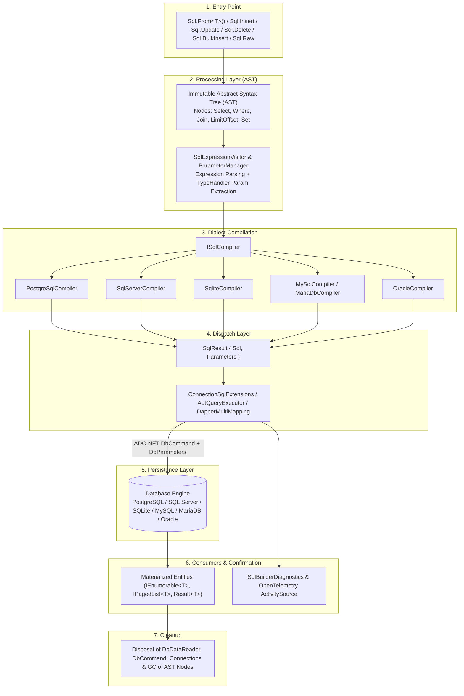
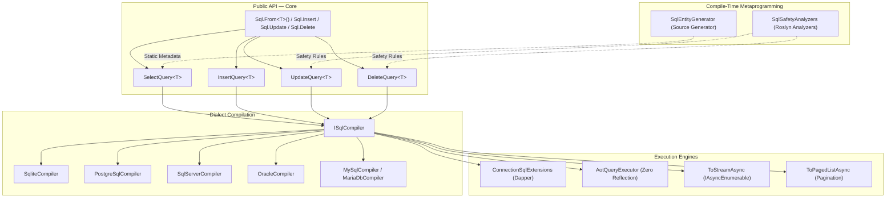
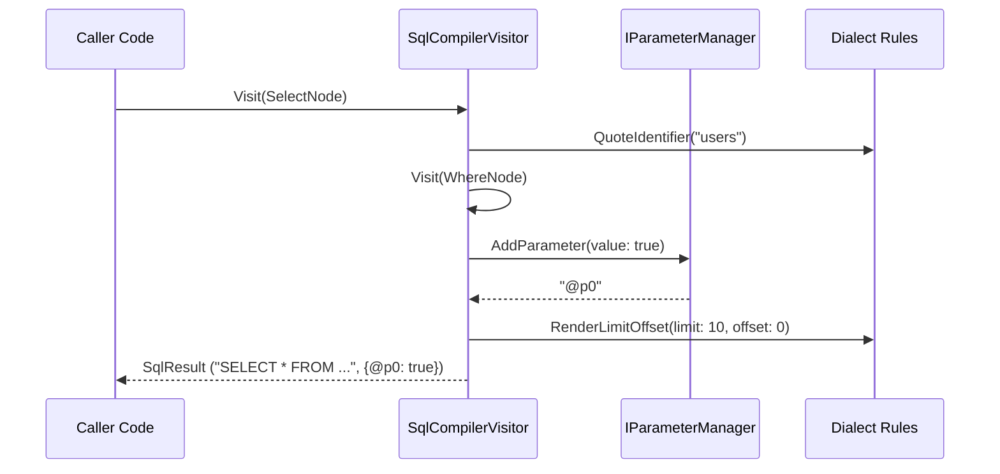
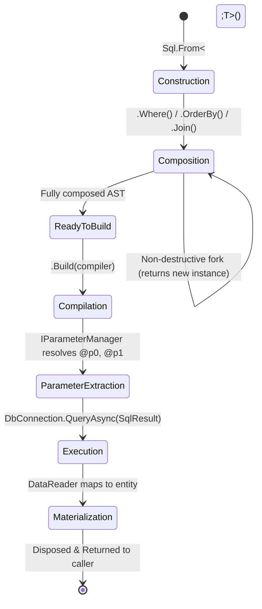
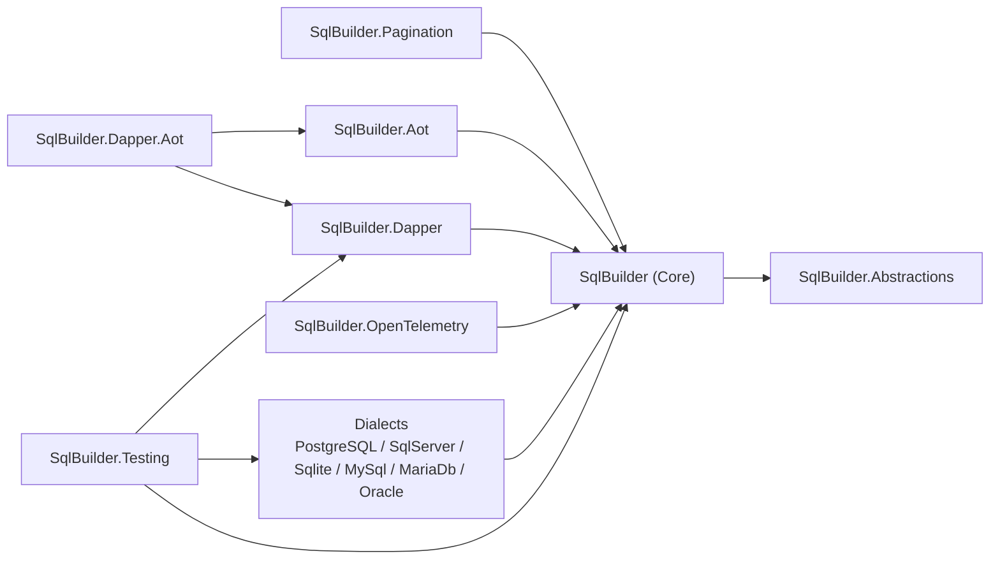
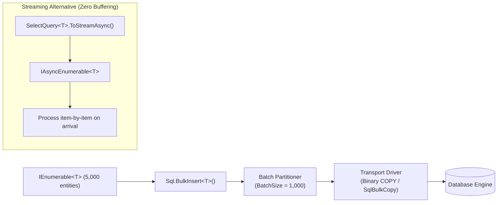
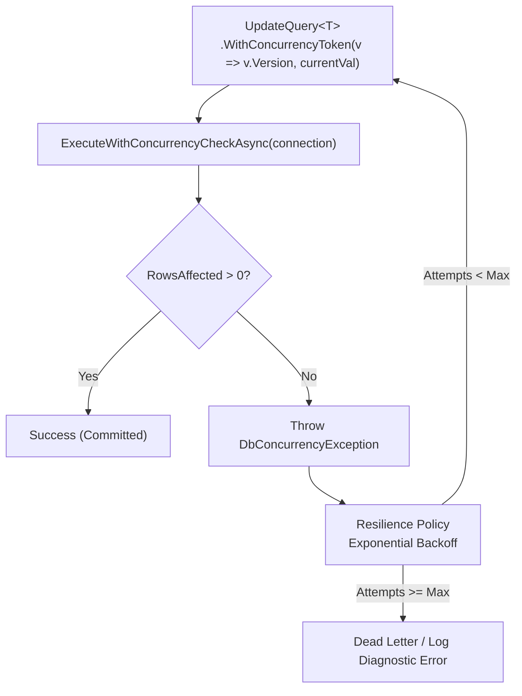
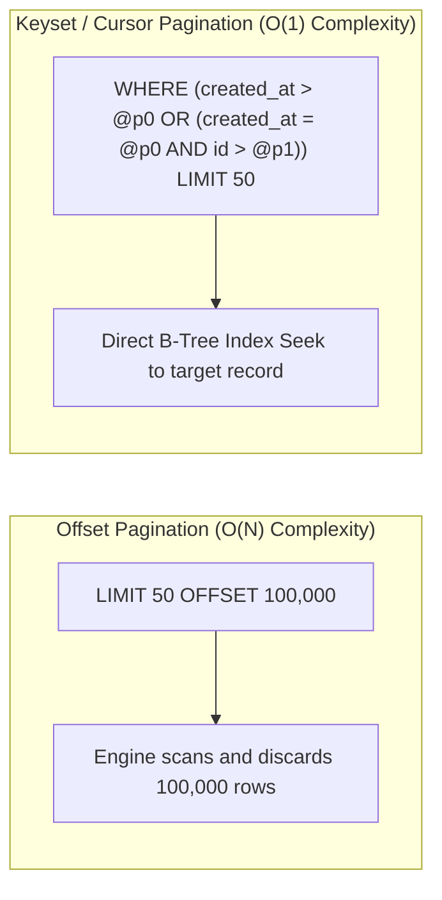

# Architecture & Functional Map — EricksonLopez.SqlBuilder

Comprehensive architectural specification and functional map of **EricksonLopez.SqlBuilder**, detailing component interactions, layer transitions, lifecycle invariants, and structural diagrams.

---

## Table of Contents

- [Architectural Mission & Objectives](#architectural-mission--objectives)
- [Functional Map: System Flow from Input to Output](#functional-map-system-flow-from-input-to-output)
  - [1. Application Entry Point](#1-application-entry-point)
  - [2. Processing Layer & AST](#2-processing-layer--ast)
  - [3. Dialect Compilation Layer](#3-dialect-compilation-layer)
  - [4. Dispatch Layer](#4-dispatch-layer)
  - [5. Persistence Layer](#5-persistence-layer)
  - [6. Domain Consumers](#6-domain-consumers)
  - [7. Confirmation & Observability](#7-confirmation--observability)
  - [8. Cleanup & Resource Disposal](#8-cleanup--resource-disposal)
- [Mermaid Architectural & Lifecycle Diagrams](#mermaid-architectural--lifecycle-diagrams)
  - [Diagram 1: General Architecture](#diagram-1-general-architecture)
  - [Diagram 2: Primary End-to-End Flow](#diagram-2-primary-end-to-end-flow)
  - [Diagram 3: Compilation & Execution Sequence](#diagram-3-compilation--execution-sequence)
  - [Diagram 4: Query Lifecycle State Machine](#diagram-4-query-lifecycle-state-machine)
  - [Diagram 5: Component Dependency Map](#diagram-5-component-dependency-map)
  - [Diagram 6: Bulk Ingestion & Streaming Pipeline](#diagram-6-bulk-ingestion--streaming-pipeline)
  - [Diagram 7: Error Handling & Optimistic Concurrency](#diagram-7-error-handling--optimistic-concurrency)
  - [Diagram 8: Pagination Mechanics: Offset vs Keyset Seek](#diagram-8-pagination-mechanics-offset-vs-keyset-seek)

---

## Architectural Mission & Objectives

**EricksonLopez.SqlBuilder** bridges the gap between heavy, high-allocation Object-Relational Mappers (ORMs) and fragile, error-prone raw SQL strings.

### Core Architectural Invariants
1. **Absolute AST Immutability**: All query structures (`SelectQuery<T>`, `InsertQuery<T>`, `UpdateQuery<T>`, `DeleteQuery<T>`) are implemented as immutable C# records using non-destructive mutations (`with` expressions). Query instances can be shared across threads and reused as base templates without race conditions or memory side effects.
2. **Zero-Reflection Native AOT Guarantees**: Entity metadata, column maps, and reader parsers are generated at compile time via C# Roslyn Source Generators (`[SqlEntity]`). Runtime execution is completely free of `System.Reflection.Emit`, `DynamicMethod`, or JIT compilation.
3. **Strict Dialect Isolation**: Core query composition is engine-agnostic. Concrete dialect differences (identifier quoting, pagination, upsert semantics, parameter prefixes) are isolated inside standalone compiler packages (`ISqlCompiler`).
4. **Compile-Time Safety Enforcement**: Built-in Roslyn Diagnostic Analyzers (`ESQL001`–`ESQL026`) detect unsafe patterns (such as unconstrained `DELETE`/`UPDATE` operations or invalid retry scopes) directly inside the developer's IDE and CI build gates.

---

## Functional Map: System Flow from Input to Output



### 1. Application Entry Point
- **Components**: Static `Sql` entrypoint (`Sql.From<T>()`, `Sql.Insert<T>()`, `Sql.Update<T>()`, `Sql.Delete<T>()`, `Sql.BulkInsert<T>()`, `Sql.Raw()`).
- **Function**: Provides strongly-typed API surface for domain consumers to initialize queries without coupling to any specific database engine.
- **Transition**: Transfers domain models into immutable query builder records.

### 2. Processing Layer & AST
- **Components**: Immutable AST nodes (`SelectNode`, `WhereNode`, `JoinNode`, `LimitOffsetNode`, `SetNode`, `ReturningNode`, `OnConflictNode`), `SqlExpressionVisitor`, `SqlEntityCache<T>`, and `IParameterManager`.
- **Function**: Evaluates C# lambda expressions (`x => x.IsActive`), resolves column names via static metadata (`IStaticEntityMetadata<T>`), and maps literal values into parameterized tokens (`@p0`, `@p1`).
- **Transition**: Transforms high-level expressions into a normalized Abstract Syntax Tree.

### 3. Dialect Compilation Layer
- **Components**: `ISqlCompiler` and concrete implementations: `PostgreSqlCompiler`, `SqlServerCompiler`, `SqliteCompiler`, `MySqlCompiler`, `MariaDbCompiler`, `OracleCompiler`.
- **Function**: Traverses the AST via the Visitor pattern (`SqlCompilerVisitor`), applying dialect-specific grammatical rules (quoting styles `[...]`, `"..."`, or `` `...` ``; pagination `LIMIT/OFFSET` vs `OFFSET...FETCH` vs `ROWNUM`; identity returns `RETURNING` vs `OUTPUT`).
- **Transition**: Emits an immutable `SqlResult` containing the final SQL string and indexed parameters dictionary.

### 4. Dispatch Layer
- **Components**: `ConnectionSqlExtensions`, `AotQueryExecutor`, `DapperMultiMappingExtensions`, and `CursorPaginationExtensions`.
- **Function**: Binds the `SqlResult` to an open `DbConnection`, constructing a parameterized `DbCommand` or delegating to the optimized materialization pipeline.
- **Transition**: Transmits the SQL command to the underlying ADO.NET provider over the network socket.

### 5. Persistence Layer
- **Components**: Target database instance (PostgreSQL, SQL Server, SQLite, MySQL, MariaDB, Oracle).
- **Function**: Executes the compiled query plan against database indexes and tables, streaming result sets (`DbDataReader`).
- **Transition**: Returns binary data streams back to the consuming client.

### 6. Domain Consumers
- **Components**: Data repositories, CQRS query handlers (MediatR), Minimal API endpoints, or background processing services.
- **Function**: Hydrates and consumes structured results (`IEnumerable<T>`, `IPagedList<T>`, `Result<T>`) to execute business logic.

### 7. Confirmation & Observability
- **Components**: `SqlBuilderDiagnostics`, `ActivitySource`, `Meter`, and `.WithTag()` query metadata.
- **Function**: Records compiled query metrics, tracks execution latencies, and emits distributed traces correlated with query tags via OpenTelemetry.

### 8. Cleanup & Resource Disposal
- **Components**: C# `using` declarations, `IAsyncDisposable` on data readers and connections, and GC recycling of immutable AST records.
- **Function**: Closes database cursors, releases connection socket handles, and returns buffer pools.

---

## Mermaid Architectural & Lifecycle Diagrams

### Diagram 1: General Architecture



---

### Diagram 2: Primary End-to-End Flow

```mermaid
sequenceDiagram
    autonumber
    participant App as Domain / Service
    participant Builder as Query Builder (SelectQuery&lt;T&gt;)
    participant Compiler as ISqlCompiler (e.g. PostgreSql)
    participant Exec as Execution Engine (Dapper / AOT)
    participant DB as Database Engine

    App->>Builder: Sql.From&lt;User&gt;().Where(u => u.IsActive).Limit(10)
    Note over Builder: Builds immutable AST Nodes<br/>without network or DB I/O
    App->>Exec: connection.QueryAsync&lt;User&gt;(query)
    Exec->>Compiler: query.Build(compiler)
    Compiler->>Compiler: Visit AST Nodes & Extract @p0
    Compiler-->>Exec: SqlResult { Sql, Parameters }
    Exec->>DB: Execute DbCommand with Parameters
    DB-->>Exec: DbDataReader Stream
    Exec-->>App: IReadOnlyList&lt;User&gt;
```

---

### Diagram 3: Compilation & Execution Sequence



---

### Diagram 4: Query Lifecycle State Machine



---

### Diagram 5: Component Dependency Map



---

### Diagram 6: Bulk Ingestion & Streaming Pipeline



---

### Diagram 7: Error Handling & Optimistic Concurrency



---

### Diagram 8: Pagination Mechanics: Offset vs Keyset Seek


