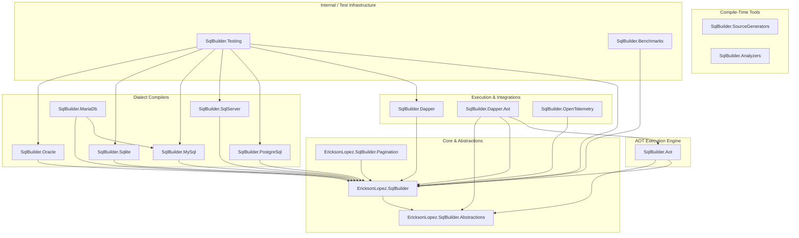
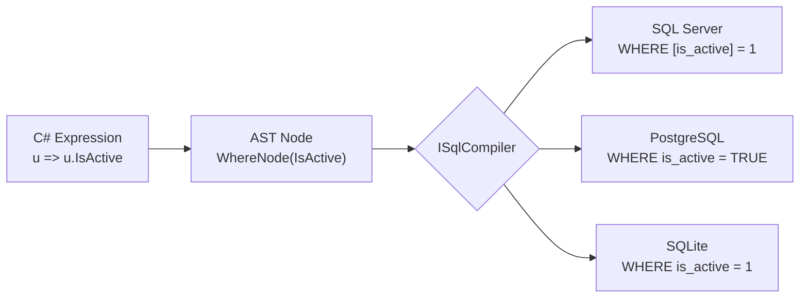

# Architecture & Design

## System Overview

**EricksonLopez.SqlBuilder** solves the problem of strongly-typed, safe, and performant SQL generation in C# applications that do not need a full ORM (like Entity Framework Core), but need more than raw SQL strings (which are error-prone and SQL-injection-prone).

### Core Objectives

1. **Immutability:** Every modification to a query builder instance yields a new instance, ensuring thread safety and predictability. See [ADR-017](decisions/adr-017-immutable-ast-record-semantics.md).
2. **Native AOT Compatibility:** Zero runtime reflection. C# Source Generators analyze `[SqlEntity]` models at compile-time. See [ADR-013](decisions/adr-013-aot-guarantees.md).
3. **High Performance:** Zero or minimal allocations during query compilation. See [ADR-014](decisions/adr-014-zero-allocation-benchmark-proof.md).
4. **Modularity:** The core generates AST nodes. Dialect compilers (`ISqlCompiler`) transform the AST into valid SQL strings and parameters. See [ADR-009](decisions/adr-009-dialect-isolation-separate-packages.md).
5. **Dapper & Native Execution:** Optional companions for Dapper execution (`EricksonLopez.SqlBuilder.Dapper`) or pure reflection-free ADO.NET execution (`EricksonLopez.SqlBuilder.Aot` and `EricksonLopez.SqlBuilder.Dapper.Aot`). See [ADR-002](decisions/adr-002-dapper-integration-optional.md) and [ADR-043](decisions/adr-043-dapper-aot-integration.md).
6. **No Hidden State:** No change tracking, no automatic caching, no DI coupling. See [ADR-007](decisions/adr-007-no-change-tracking.md), [ADR-024](decisions/adr-024-no-automatic-query-caching.md), [ADR-023](decisions/adr-023-no-di-logging-core-dependencies.md).

---

## Internal Package Dependency Diagram



---

## Key Architectural Patterns

### 1. Immutable AST via C# Record Semantics (ADR-017)

All query builders (`SelectQuery<T>`, `InsertQuery<T>`, `UpdateQuery<T>`, `DeleteQuery<T>`) are implemented as immutable records or classes using **with-expressions**. Calling `.Where()` does not mutate the original — it returns a new instance.

**Why:** Prevents unintended side effects when a base query is shared across threads or composed into variants.

```csharp
var baseQuery = Sql.From<User>().Where(u => u.IsActive);

// Neither of these mutates 'baseQuery':
var admins = baseQuery.Where(u => u.Role == "Admin");
var paged  = baseQuery.Limit(20).Offset(40);
```

### 2. Source Generators & NativeAOT (ADR-006, ADR-013, ADR-043)

Entity classes tagged with `[SqlEntity]` are processed at compile-time by the Roslyn incremental generator in `EricksonLopez.SqlBuilder.SourceGenerators`. The generator emits:

- `IStaticEntityMetadata<T>` — static table name, column list, ordinal mapping
- `IDataReaderMapper<T>` — zero-reflection materializer (ordinal-based)
- Diff update support — computes changed columns at compile time

**Why:** Enables NativeAOT compatibility and eliminates `System.Reflection.Emit` from all hot paths.

### 3. Separation of AST and Compilers (ADR-009)

The core library only generates an **Abstract Syntax Tree (AST)**. It does not know how to write SQL. The `ISqlCompiler` implementations in dialect packages transform the AST to SQL strings.

**Why:** Adheres to the Open/Closed Principle. New dialects can be added without modifying the core.



### 4. Dapper and Native AOT Execution Layers (ADR-002, ADR-043)

The core library has no dependency on Dapper. 
- `EricksonLopez.SqlBuilder.Dapper` adds extension methods (`QueryAsync`, `ExecuteAsync`, `BulkInsertAsync`) for existing Dapper applications.
- `EricksonLopez.SqlBuilder.Aot` and `EricksonLopez.SqlBuilder.Dapper.Aot` provide reflection-free execution paths over `IDbConnection` without runtime code generation.

### 5. Granular Package Separation (ADR-009, ADR-030)

The ecosystem is split into granular packages to implement **pay-for-play**:
- A project using SQL Server does not download PostgreSQL or Oracle drivers.
- The AOT execution path (`Aot` package) is isolated from Dapper's reflection.
- Pagination extensions are centralized in `EricksonLopez.SqlBuilder.Pagination`.

### 6. No DI, No Logging, No Hidden Dependencies (ADR-023)

The core library does not depend on `Microsoft.Extensions.DependencyInjection` or `Microsoft.Extensions.Logging`. Users choose their own infrastructure. Observability is provided via standard `System.Diagnostics` / `ActivitySource`.

---

## Architecture Decision Records (ADRs)

All significant architectural decisions are documented in [`docs/decisions/`](decisions/index.md).

**Quick Reference:**

| ADR | Decision | Status |
|---|---|:---:|
| [ADR-001](decisions/adr-001-stryker-source-generator-exclusion.md) | Stryker excludes Source Generators from mutation | ✅ Accepted |
| [ADR-002](decisions/adr-002-dapper-integration-optional.md) | Dapper integration is optional | ✅ Accepted |
| [ADR-003](decisions/adr-003-polly-not-core-dependency.md) | Polly is never a Core dependency | ✅ Accepted |
| [ADR-007](decisions/adr-007-no-change-tracking.md) | No change tracking | ✅ Accepted |
| [ADR-008](decisions/adr-008-no-linq-iqueryable-provider.md) | No LINQ IQueryable provider | ✅ Accepted |
| [ADR-009](decisions/adr-009-dialect-isolation-separate-packages.md) | Dialect isolation in separate packages | ✅ Accepted |
| [ADR-013](decisions/adr-013-aot-guarantees.md) | NativeAOT guarantees and scope | ✅ Accepted |
| [ADR-017](decisions/adr-017-immutable-ast-record-semantics.md) | Immutable AST via record semantics | ✅ Accepted |
| [ADR-023](decisions/adr-023-no-di-logging-core-dependencies.md) | No DI or logging as Core dependencies | ✅ Accepted |
| [ADR-024](decisions/adr-024-no-automatic-query-caching.md) | No automatic query caching | ✅ Accepted |
| [ADR-025](decisions/adr-025-no-generic-merge-abstraction.md) | No generic cross-dialect MERGE abstraction | ✅ Accepted |
| [ADR-038](decisions/adr-038-opentelemetry-semantic-conventions.md) | OpenTelemetry database semantic conventions | ✅ Accepted |
| [ADR-043](decisions/adr-043-dapper-aot-integration.md) | Dapper.AOT integration package strategy | ✅ Accepted |
| [ADR-046](decisions/adr-046-bulk-identity-retrieval-boundary.md) | Bulk identity retrieval boundary and client UUIDv7 keys | ✅ Accepted |

See [ADR Index](decisions/index.md) for the complete list of all ADRs.
