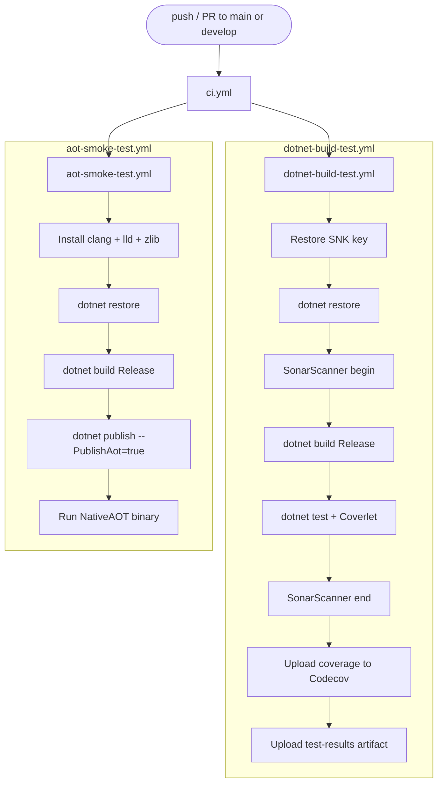

# CI/CD Pipelines Architecture & Quality Gates

This document defines the complete Continuous Integration and Continuous Deployment (CI/CD) architecture, quality gates, and automated validation workflows for `EricksonLopez.SqlBuilder`.

---

## 1. Overview of All Pipelines

| Pipeline Name | Workflow File | Trigger | Primary Purpose |
|---|---|---|---|
| **Main CI** | `ci.yml` | `push`, `pull_request` (`main`, `develop`) | Fast PR feedback: builds, tests, coverage, NativeAOT smoke test |
| **Reusable Build & Test** | `dotnet-build-test.yml` | `workflow_call` | Build, test, coverage, SonarCloud |
| **NativeAOT Smoke Test** | `aot-smoke-test.yml` | `push`/`PR`, `workflow_call`, `workflow_dispatch` | Compile and run a NativeAOT binary (`PublishAot=true`) |
| **Publish NuGet** | `publish.yml` | `push v*.*.*` tag, `workflow_dispatch` | Pack + sign + publish all packages to NuGet |
| **Release Please** | `release-please.yml` | `push` → `main` | Automated release PR + dispatch publish |
| **Mutation Testing** | `mutation-testing.yml` | Schedule Mon 04:00 UTC, `workflow_dispatch` | Stryker mutation analysis across dialect packages |
| **Benchmarks** | `benchmarks.yml` | `workflow_call`, `workflow_dispatch` | BenchmarkDotNet baseline capture |
| **Weekly Benchmarks** | `weekly-benchmarks.yml` | Schedule Sun 02:00 UTC, `workflow_dispatch` | Deep benchmark across .NET 8 + 9 + 10 |
| **Repo Compliance** | `repo-compliance.yml` | `push`/`PR` (`main`), `workflow_dispatch` | Architecture, licensing, and compliance invariants |

---

## 2. CI Pipeline Flow

The main CI orchestrator (`ci.yml`) runs on every push and pull request to `main` or `develop`. It delegates execution to reusable workflows via `uses:`.

> [!NOTE]
> **Mutation Testing is NOT part of the main CI.** It runs as a separate scheduled job (`mutation-testing.yml`) every Monday at 04:00 UTC, or on manual dispatch to keep PR latency minimal.

---

## 3. Release → Publish Flow

Releases are managed by **Release Please** (`release-please.yml`), which creates automated release PRs based on Conventional Commits. When a release PR is merged:

1. Release Please creates a GitHub Release and a `vX.Y.Z` git tag.
2. `release-please.yml` dispatches `publish.yml` via `workflow_dispatch`.

```mermaid
flowchart LR
    A([Conventional Commit merged to main]) --> B[release-please.yml]
    B --> C{Release PR exists?}
    C -- No --> D[Create/Update Release PR]
    C -- Yes, merged --> E[Create GitHub Release + tag vX.Y.Z]
    E --> F[Dispatch publish.yml]

    subgraph publish.yml
        F --> G[Restore SNK key]
        G --> H[dotnet restore + build Release]
        H --> I[dotnet test — publish gate]
        I --> J[Upload coverage — publish-gate flag]
        J --> K[dotnet pack — all packages]
        K --> L[Sigstore Provenance Attestation]
        L --> M[NuGet OIDC login]
        M --> N[dotnet nuget push --skip-duplicate]
        N --> O[Create GitHub Release body with package table]
    end
```

---

## 4. NativeAOT Smoke Test Pipeline

Validates that `EricksonLopez.SqlBuilder` packages genuinely compile and run under Native AOT:

1. Publishes `tests/EricksonLopez.SqlBuilder.AotSmokeTest/` with `--PublishAot=true` and `-p:TreatWarningsAsErrors=true`.
2. Any IL2026 or IL3050 from the trimmer is treated as a build-breaking error.
3. Executes the native binary and asserts a 0 exit code.

---

## 5. Mutation Testing Quality Gates

Stryker mutation testing enforces rigorous quality thresholds:
- **High Threshold**: $\ge 100\%$ (Target)
- **Low Threshold**: $\ge 98\%$ (Acceptable)
- **Break Threshold**: $< 95\%$ (Build Failure)
