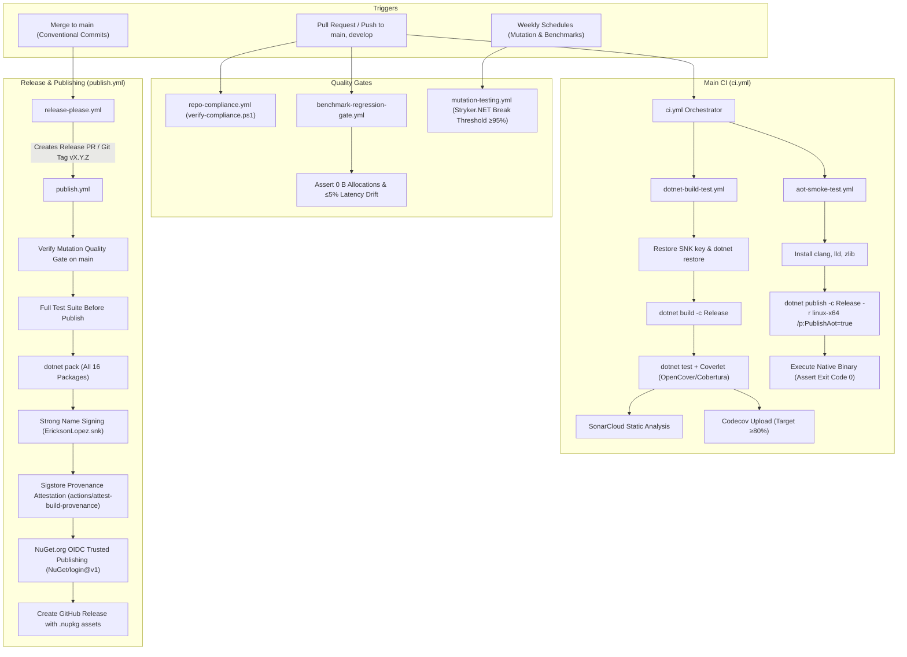

# Build, CI/CD, and Quality Gates

This document defines the Continuous Integration (CI), Continuous Deployment (CD), automated quality gates, supply chain security, and testing infrastructure for **EricksonLopez.SqlBuilder**.

---

## 1. CI/CD Architecture Overview

The repository uses 10 modular GitHub Actions workflows located in [`.github/workflows/`](../.github/workflows/):

| Workflow | File | Trigger | Purpose |
|---|---|---|---|
| **Main CI** | [`ci.yml`](../.github/workflows/ci.yml) | `push` / `PR` (`main`, `develop`) | Fast PR orchestrator: runs build & unit tests and Native AOT smoke test |
| **Reusable Build & Test** | [`dotnet-build-test.yml`](../.github/workflows/dotnet-build-test.yml) | `workflow_call` | Solution compilation, test execution, Codecov upload, and SonarCloud analysis |
| **Native AOT Smoke Test** | [`aot-smoke-test.yml`](../.github/workflows/aot-smoke-test.yml) | `push` / `PR`, `workflow_call`, `dispatch` | Validates Native AOT binary compilation (`PublishAot=true`) and execution on Linux x64 |
| **Publish NuGet** | [`publish.yml`](../.github/workflows/publish.yml) | Tag `v*.*.*`, `workflow_dispatch` | Packs all 16 packages, signs with SNK, validates mutation gate, attests provenance, and publishes to NuGet.org via OIDC |
| **Release Please** | [`release-please.yml`](../.github/workflows/release-please.yml) | `push` to `main` | Automates Conventional Commits changelog, creates release PRs, and dispatches `publish.yml` |
| **Repo Compliance** | [`repo-compliance.yml`](../.github/workflows/repo-compliance.yml) | `push` / `PR` (`main`), `dispatch` | Enforces architecture invariants, licensing, kebab-case docs, and packaging rules |
| **Mutation Testing** | [`mutation-testing.yml`](../.github/workflows/mutation-testing.yml) | Schedule (Mon 04:00 UTC), `dispatch`, `call` | Stryker.NET mutation testing matrix across packages with strict 95% break threshold |
| **Benchmarks** | [`benchmarks.yml`](../.github/workflows/benchmarks.yml) | `workflow_call`, `workflow_dispatch` | On-demand BenchmarkDotNet suite execution |
| **Weekly Benchmarks** | [`weekly-benchmarks.yml`](../.github/workflows/weekly-benchmarks.yml) | Schedule (Sun 02:00 UTC), `dispatch` | Deep benchmark profiling across .NET 8, 9, and 10 |
| **Benchmark Regression Gate** | [`benchmark-regression-gate.yml`](../.github/workflows/benchmark-regression-gate.yml) | `PR` (`src/**`, `benchmarks/**`), `dispatch` | PR gate: asserts 0 B allocation on hot paths and ≤5% latency regression vs baseline |

---

## 2. End-to-End Pipeline Flow

---

## 3. Workflow Specifications

### 1. Main CI (`ci.yml`)
- **Triggers**: `push` and `pull_request` targeting `main` or `develop`.
- **Jobs**:
  - `build-and-test`: Invokes `dotnet-build-test.yml` with `artifact-name: test-results`.
  - `aot-smoke-test`: Invokes `aot-smoke-test.yml`.
- **Secrets Passed**: `SNK_KEY`, `CODECOV_TOKEN`, `SONAR_TOKEN`.

### 2. Reusable .NET Build & Test (`dotnet-build-test.yml`)
- **Inputs**: `dotnet-version` (default: `10.0.x`), `test-filter`, `test-project`, `upload-coverage` (default: `true`), `artifact-name` (default: `test-results`).
- **Secrets**: `SNK_KEY`, `CODECOV_TOKEN`, `SONAR_TOKEN`.
- **Steps**:
  1. Checkout with full git depth (`fetch-depth: 0`).
  2. Setup .NET SDK.
  3. Decode base64 Strong Name key (`SNK_KEY`) to `EricksonLopez.snk` when available.
  4. Setup Java 17 Zulu and install `dotnet-sonarscanner`.
  5. Begin SonarScanner analysis targeting project key `ericksonlopezf_dotnet-sql-builder`.
  6. Compile solution in `Release` configuration (`TreatWarningsAsErrors=true`).
  7. Execute tests across all test projects using `.runsettings` and collect OpenCover/Cobertura coverage.
  8. Finalize SonarScanner analysis.
  9. Upload test results `.trx` as workflow artifacts.
  10. Upload coverage reports to Codecov with flag `unittests`.

### 3. Native AOT Smoke Test (`aot-smoke-test.yml`)
- **Triggers**: `workflow_call`, `push` / `PR` to `main`, `develop`, and manual `workflow_dispatch`.
- **Timeout**: 20 minutes.
- **Environment**: Ubuntu Latest with native tools `clang`, `lld`, `zlib1g-dev`.
- **Steps**:
  1. Sets up .NET 8.0, 9.0, and 10.0 SDKs.
  2. Publishes `tests/EricksonLopez.SqlBuilder.AotSmokeTest` with `--runtime linux-x64 --self-contained -p:TreatWarningsAsErrors=true` and `DOTNET_EnableAotCompilationWarningsAsErrors=true`.
  3. Executes the resulting native ELF binary directly (`./aot-output/EricksonLopez.SqlBuilder.AotSmokeTest`) and validates exit code `0`.

### 4. Publish NuGet (`publish.yml`)
- **Triggers**: Pushing a `v*.*.*` git tag, or via `workflow_dispatch` with an optional `version` input.
- **Permissions**: `id-token: write` (for OIDC token exchange), `attestations: write` (for Sigstore provenance), `contents: write` (for GitHub releases).
- **Jobs**:
  1. `mutation-gate-check`: Evaluates the Stryker mutation gate on `main` via `scripts/verify-mutation-gate.js`.
  2. `stryker-gate`: Conditional job running `mutation-testing.yml` if mutation evaluation requires fresh execution.
  3. `publish`: Packs all 16 ecosystem packages into `./nupkgs`, generates Sigstore build provenance attestation (`actions/attest-build-provenance@v2`), obtains an ephemeral OIDC token via `NuGet/login@v1`, pushes packages to NuGet.org with `--skip-duplicate`, and drafts a GitHub release.

### 5. Release Please (`release-please.yml`)
- **Trigger**: Push to `main`.
- **Action**: `googleapis/release-please-action@v4.1.3` configured with `.release-please-config.json` and `.release-please-manifest.json`.
- **Automation**: When a release PR is merged, it tags the commit (`vX.Y.Z`) and automatically triggers `publish.yml` via GitHub REST API `createWorkflowDispatch`.

### 6. Repository Compliance & Architecture Gate (`repo-compliance.yml`)
- **Triggers**: Push and PR targeting `main`, or manual `workflow_dispatch`.
- **Validation**: Executes `./scripts/verify-compliance.ps1` enforcing kebab-case documentation naming, zero `[Obsolete]` usages in `src/`, canonical MIT copyright headers, one type per file, and package table parity.
- **Build Invariants**: Runs `dotnet build` with strict diagnostics, executes all unit tests, and validates `dotnet pack`.

### 7. Mutation Testing (`mutation-testing.yml`)
- **Triggers**: Scheduled weekly (Monday at 04:00 UTC), `workflow_call`, and manual `workflow_dispatch` (`mutation-level`: Basic, Standard, Advanced).
- **Matrix**: Runs parallel Stryker instances across all applicable packages (`Core`, `Abstractions`, `Aot`, `Analyzers`, `Dapper`, `DapperAot`, `MariaDb`, `MySql`, `Oracle`, `Pagination`, `PostgreSql`, `SourceGenerators`, `Sqlite`, `SqlServer`, `Testing`).
- **Thresholds**: Defined in `stryker-*.json` (High: 100%, Low: 98%, Break: 95%).

### 8. Benchmarks (`benchmarks.yml`)
- **Triggers**: `workflow_call` and manual `workflow_dispatch` with customizable `benchmark-filter` (default: `*`).
- **Execution**: Runs BenchmarkDotNet suite on `benchmarks/EricksonLopez.SqlBuilder.Benchmarks` in `Release` configuration and archives JSON/Markdown benchmark results.

### 9. Weekly Benchmarks (`weekly-benchmarks.yml`)
- **Triggers**: Scheduled weekly (Sunday at 02:00 UTC) and manual `workflow_dispatch`.
- **Environment**: Multi-TFM runtime evaluation across .NET 8, 9, and 10 to detect compiler performance drifts across framework versions.

### 10. Benchmark Regression Gate (`benchmark-regression-gate.yml`)
- **Triggers**: Pull requests modifying `src/**` or `benchmarks/**`, and manual `workflow_dispatch`.
- **Enforcement**: Runs BenchmarkDotNet and executes `scripts/verify-benchmark-gate.ps1`:
  - **Zero-Allocation Invariant**: Asserts that core combinators allocate exactly 0 B on hot execution paths.
  - **Latency Regression Limit**: Asserts that mean execution time does not regress by more than 5% against `benchmarks/results/baseline.json`.

---

## 4. Quality Gates Matrix

| Quality Gate | Tool / Mechanism | Target Threshold | Pipeline Enforcement |
|---|---|---|---|
| **Compilation Diagnostics** | MSBuild / Roslyn | Zero warnings (`TreatWarningsAsErrors=true`) | All build & test workflows |
| **Unit Test Suite** | xUnit + AwesomeAssertions | 100% Passing (0 failures, 0 skipped) | `ci.yml`, `publish.yml`, `repo-compliance.yml` |
| **Code Coverage** | Coverlet + Codecov | Target: ≥80%, Threshold: 2% | `dotnet-build-test.yml`, `publish.yml` |
| **Mutation Score** | Stryker.NET | Break: <95%, Low: ≥98%, High: 100% | `mutation-testing.yml`, `publish.yml` pre-gate |
| **Native AOT Compatibility** | NativeAOT ILC Compiler | Zero trimming warnings (`IL2026`, `IL3050`) | `aot-smoke-test.yml` |
| **Performance Regression** | BenchmarkDotNet + Script | 0 B allocations on hot path; ≤5% latency delta | `benchmark-regression-gate.yml` |
| **Public API Surface** | `Microsoft.CodeAnalysis.PublicApiAnalyzers` | Zero undeclared public symbols | Build-time enforcement in all library projects |
| **Static Code Analysis** | SonarCloud + Roslyn Analyzers | Clean Quality Gate (Zero bugs/vulnerabilities) | `dotnet-build-test.yml` |
| **Architecture Compliance** | `verify-compliance.ps1` | Zero compliance violations | `repo-compliance.yml` |
| **Dependency Auditing** | NuGetAudit (`all` / `low`) + Dependabot | Zero unpatched vulnerabilities | Evaluated on every build & weekly scan |

---

## 5. Required Secrets & Scopes

| Secret Name | Description | Workflows Using Secret |
|---|---|---|
| `SNK_KEY` | Base64-encoded RSA private key for Strong Name assembly signing | `ci.yml`, `dotnet-build-test.yml`, `publish.yml`, `aot-smoke-test.yml`, `benchmarks.yml` |
| `CODECOV_TOKEN` | Authentication token for uploading coverage reports to Codecov | `dotnet-build-test.yml`, `publish.yml` |
| `SONAR_TOKEN` | SonarCloud authentication token for quality gate reporting | `dotnet-build-test.yml` |
| `GITHUB_TOKEN` | Built-in token used for release creation, PR dispatch, and workflow management | `release-please.yml`, `publish.yml`, `dotnet-build-test.yml` |

---

## 6. Supply Chain Security Invariants

1. **Ephemeral OIDC Publishing**: No static NuGet API tokens are stored in repository secrets. Publishing uses GitHub OpenID Connect federated credentials via `NuGet/login@v1`.
2. **Sigstore Build Provenance**: All `.nupkg` binaries receive cryptographic provenance attestations via `actions/attest-build-provenance@v2`, tying artifacts directly to the exact commit SHA and workflow run.
3. **Strong Name Signing**: Assemblies are signed using RSA key `EricksonLopez.snk` with public key token declared centrally in `Directory.Build.props`.
4. **Deterministic Compilation**: Builds in CI enforce `<ContinuousIntegrationBuild>true</ContinuousIntegrationBuild>` and `<Deterministic>true</Deterministic>`, guaranteeing bit-for-bit reproducible assemblies.
5. **SourceLink Debugging**: Embedded SourceLink metadata enables consumers to inspect source code and step into library frames with verified commit hashes.
