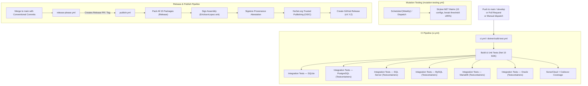

# Build, CI/CD, and Quality Gates

This document describes the Continuous Integration pipeline, release process, quality gates, and supply chain security for the repository.

---

## CI/CD Pipeline Architecture

The repository uses modular GitHub Actions workflows configured in [`.github/workflows/`](../.github/workflows/):

- **[`ci.yml`](../.github/workflows/ci.yml)** — Main Continuous Integration pipeline (Unit tests, multi-dialect integration tests with Testcontainers).
- **[`dotnet-build-test.yml`](../.github/workflows/dotnet-build-test.yml)** — Reusable build, test, SonarCloud, and coverage workflow.
- **[`mutation-testing.yml`](../.github/workflows/mutation-testing.yml)** — Scheduled and dispatch mutation testing matrix using Stryker.NET.
- **[`release-please.yml`](../.github/workflows/release-please.yml)** — Automated changelog and SemVer release management.
- **[`publish.yml`](../.github/workflows/publish.yml)** — Pack, Sign, Sigstore Attestation, and NuGet.org OIDC publishing.

---

## Workflow Details

### 1. Main CI (`ci.yml`)
- **Triggers**: `push` (`main`, `develop`), `pull_request` (`main`, `develop`), `workflow_dispatch` (optional benchmark flag).
- **Jobs**:
  - `build-and-test`: Calls `dotnet-build-test.yml` for restore, compilation, unit test execution, and Codecov upload.
  - `integration-tests-sqlite`: In-memory SQLite integration tests.
  - `integration-tests-postgresql`: PostgreSQL 16 (Testcontainers).
  - `integration-tests-sqlserver`: MSSQL Server 2022 (Testcontainers).
  - `integration-tests-mysql`: MySQL 8.3 (Testcontainers).
  - `integration-tests-mariadb`: MariaDB 11.3 (Testcontainers).
  - `integration-tests-oracle`: Oracle Free (Testcontainers).
- **Environment**: .NET 10.0.x SDK with roll-forward from `global.json`.

### 2. Reusable Build (`dotnet-build-test.yml`)
- **Inputs**: `dotnet-version`, `test-filter`, `upload-coverage`, `artifact-name`.
- **Secrets**: `SNK_KEY`, `CODECOV_TOKEN`, `SONAR_TOKEN`.

### 3. Mutation Testing (`mutation-testing.yml`)
- **Triggers**: Weekly schedule (Monday 04:00 UTC) and `workflow_dispatch` (Basic, Standard, Advanced).
- **Policy**: Governed by `stryker-*.json` files. High: 100%, Low: 98%, Warn: 95%, Break: 95%.
- **Exclusions**: `SourceGenerators`, `Analyzers`, `Benchmarks` (per ADR-001).

### 4. Release Automation (`release-please.yml`)
- Follows [Conventional Commits](https://www.conventionalcommits.org/). Automatically drafts release PRs and tags releases upon merge.

### 5. Publishing Pipeline (`publish.yml`)
- **Triggers**: Automatic invocation by `release-please` or git tag `v*.*.*`.
- **Quality Gates**:
  - Validates Stryker mutation quality gate before packing.
  - Runs full unit test suite with coverage upload.
- **Sigstore Attestation**: Uses `actions/attest-build-provenance` for cryptographic build provenance.
- **NuGet Trusted Publishing**: Uses OIDC token exchange via `NuGet/login@v1` with zero long-lived API keys.

---

## Quality Gates & Static Analysis

| Gate | Tool | Target / Threshold | Enforcement |
|---|---|---|---|
| **Code Coverage** | Coverlet + Codecov | ≥80% Project & Patch Coverage | Uploaded in PRs and publish workflows |
| **Mutation Score** | Stryker.NET | ≥95% Break Threshold | Matrix jobs and publish pre-gate |
| **Static Analysis** | SonarCloud + Roslyn Analyzers | Zero Quality Gate failures | `Directory.Build.props` (TreatWarningsAsErrors) |
| **Public API Surface** | `Microsoft.CodeAnalysis.PublicApiAnalyzers` | 100% Shipped/Unshipped tracking | Build breaks on undeclared changes |
| **Dependency Scanning** | Dependabot + NuGetAudit | All vulnerabilities (Low+) | Scanned weekly and on every build |

---

## Supply Chain Security

| Security Control | Implementation |
|---|---|
| **Strong Naming** | Assembly signing with `EricksonLopez.snk` restored from secret `SNK_KEY` |
| **Sigstore Attestation** | GitHub artifact provenance attestation (`actions/attest-build-provenance@v2`) |
| **OIDC Publishing** | GitHub OIDC federated credentials to NuGet.org (no static API tokens) |
| **Reproducible Builds** | Deterministic compilation flags (`<ContinuousIntegrationBuild>true</ContinuousIntegrationBuild>`) |
| **SourceLink** | `Microsoft.SourceLink.GitHub` symbol embedding with `.snupkg` publishing |
