# NuGet Packages and Compatibility

This document describes the complete ecosystem of NuGet packages produced by this repository, their target frameworks, dependency relationships, and compatibility matrix.

## Package Ecosystem

The repository is modularized into 16 granular packages following a **pay-for-play** dependency model: consumers install only the packages they actually need. See [`docs/architecture.md`](architecture.md) for architectural justification (ADR-009).

```mermaid
graph TD
    classDef core fill:#e1f5fe,stroke:#0288d1,stroke-width:2px;
    classDef dialect fill:#e8f5e9,stroke:#388e3c,stroke-width:2px;
    classDef integ fill:#fff3e0,stroke:#f57c00,stroke-width:2px;
    classDef dev fill:#f3e5f5,stroke:#7b1fa2,stroke-width:2px;

    Abs["EricksonLopez.SqlBuilder.Abstractions"]:::core
    Core["EricksonLopez.SqlBuilder"]:::core

    SqlServer["EricksonLopez.SqlBuilder.SqlServer"]:::dialect
    PostgreSql["EricksonLopez.SqlBuilder.PostgreSql"]:::dialect
    MySql["EricksonLopez.SqlBuilder.MySql"]:::dialect
    MariaDb["EricksonLopez.SqlBuilder.MariaDb"]:::dialect
    Sqlite["EricksonLopez.SqlBuilder.Sqlite"]:::dialect
    Oracle["EricksonLopez.SqlBuilder.Oracle"]:::dialect

    Dapper["EricksonLopez.SqlBuilder.Dapper"]:::integ
    Aot["EricksonLopez.SqlBuilder.Aot"]:::integ
    DapperAot["EricksonLopez.SqlBuilder.Dapper.Aot"]:::integ
    Pagination["EricksonLopez.SqlBuilder.Pagination"]:::integ
    Otel["EricksonLopez.SqlBuilder.OpenTelemetry"]:::integ
    Testing["EricksonLopez.SqlBuilder.Testing"]:::integ

    Analyzers["EricksonLopez.SqlBuilder.Analyzers"]:::dev
    SourceGen["EricksonLopez.SqlBuilder.SourceGenerators"]:::dev

    Core --> Abs

    SqlServer --> Core
    PostgreSql --> Core
    MySql --> Core
    MariaDb --> MySql
    MariaDb --> Core
    Sqlite --> Core
    Oracle --> Core

    Dapper --> Core
    Aot --> Core
    Aot --> Abs
    DapperAot --> Aot
    DapperAot --> Core
    DapperAot --> Abs
    Pagination --> Core
    Otel --> Core

    Testing --> Core
    Testing --> Dapper
    Testing --> PostgreSql
    Testing --> SqlServer
    Testing --> MySql
    Testing --> Sqlite
    Testing --> Oracle
```

---

## Published Packages

### Core Packages

| Package Name | Description | Target Frameworks | AOT Safe |
|---|---|---|:---:|
| `EricksonLopez.SqlBuilder` | Core fluent query builder, AST generator, dialect configuration APIs | `net8.0`, `net9.0`, `net10.0` | ✅ |
| `EricksonLopez.SqlBuilder.Abstractions` | Interfaces (`ISqlCompiler`, `ISqlNode`), attributes (`[SqlEntity]`, `[DatabaseGenerated]`), shared types | `net8.0`, `net9.0`, `net10.0` | ✅ |

### Dialect Compilers

Each package provides `ISqlCompiler` and bulk execution implementations for a specific database engine. Install only the dialect(s) your application targets.

| Package Name | Engine | Key Features | Target Frameworks |
|---|---|---|---|
| `EricksonLopez.SqlBuilder.SqlServer` | SQL Server / Azure SQL | `SqlBulkCopyStrategy`, `SqlBulkMergeStrategy`, `OUTPUT` clause, bracket delimiters | `net8.0`, `net9.0`, `net10.0` |
| `EricksonLopez.SqlBuilder.PostgreSql` | PostgreSQL | `NpgsqlCopyStrategy`, `NpgsqlBulkMergeStrategy`, `RETURNING`, `ON CONFLICT`, double-quote delimiters | `net8.0`, `net9.0`, `net10.0` |
| `EricksonLopez.SqlBuilder.MySql` | MySQL | `MySqlBatchStrategy`, `MySqlBulkMergeStrategy`, `ON DUPLICATE KEY UPDATE`, backtick delimiters | `net8.0`, `net9.0`, `net10.0` |
| `EricksonLopez.SqlBuilder.MariaDb` | MariaDB | Dedicated MariaDB dialect compiler inheriting MySQL AST visitor | `net8.0`, `net9.0`, `net10.0` |
| `EricksonLopez.SqlBuilder.Sqlite` | SQLite | Lightweight, zero external driver dependency, square bracket delimiters | `net8.0`, `net9.0`, `net10.0` |
| `EricksonLopez.SqlBuilder.Oracle` | Oracle | `OracleBulkCopyStrategy`, `Oracle.ManagedDataAccess.Core` driver, FETCH FIRST & ROWNUM pagination | `net8.0`, `net9.0`, `net10.0` |

### Integration, Execution & Pagination Packages

| Package Name | Description | Target Frameworks | AOT Safe |
|---|---|---|:---:|
| `EricksonLopez.SqlBuilder.Dapper` | Extension methods: `connection.QueryAsync(builder)`, multi-mapping (2–7 types), bulk operations | `net8.0`, `net9.0`, `net10.0` | ⚠️ Dapper uses reflection |
| `EricksonLopez.SqlBuilder.Dapper.Aot` | Dapper.AOT & NativeAOT reflection-free execution extensions over `DbConnection` | `net8.0`, `net9.0`, `net10.0` | ✅ |
| `EricksonLopez.SqlBuilder.Aot` | Reflection-free `AotQueryExecutor` for NativeAOT-compatible query execution | `net8.0`, `net9.0`, `net10.0` | ✅ |
| `EricksonLopez.SqlBuilder.Pagination` | Offset and keyset cursor pagination extension methods for `SelectQuery` AST | `net8.0`, `net9.0`, `net10.0` | ✅ |
| `EricksonLopez.SqlBuilder.OpenTelemetry` | OpenTelemetry `ActivitySource` tracing integration with semantic SQL attributes | `net8.0`, `net9.0`, `net10.0` | ✅ |
| `EricksonLopez.SqlBuilder.Testing` | Test fixtures, mock compiler, SQL assertion helpers, and Testcontainers harness | `net8.0`, `net9.0`, `net10.0` | ⚠️ Test utility |

### Developer Tools & Roslyn Analyzers

| Package Name | Description | Target Frameworks |
|---|---|---|
| `EricksonLopez.SqlBuilder.Analyzers` | Roslyn analyzers enforcing SQL injection safety, identifier validation, and best practices (`ESQL`, `ELSB` rules) | `netstandard2.0` |
| `EricksonLopez.SqlBuilder.SourceGenerators` | Zero-reflection compile-time entity metadata generation for NativeAOT materialization | `netstandard2.0` |

---

## Non-Packable Internal Projects

The following projects are part of the solution but are not published as NuGet packages (`<IsPackable>false</IsPackable>` or non-packable project configurations):

| Project | Location | Purpose |
|---|---|---|
| `EricksonLopez.SqlBuilder.Benchmarks` | `benchmarks/EricksonLopez.SqlBuilder.Benchmarks/` | BenchmarkDotNet performance suite benchmarking query compilation, allocations, and ORM comparisons |
| `EricksonLopez.SqlBuilder.Samples` | `samples/EricksonLopez.SqlBuilder.Samples/` | End-to-end runnable usage samples showcasing all features and dialects |
| Playgrounds | `samples/Playgrounds/*` | Interactive playground consoles for SQL Server, PostgreSQL, MySQL, MariaDB, SQLite, Oracle |
| Test Suites | `tests/*` | Unit, integration (Testcontainers), architecture (NetArchTest), and NativeAOT smoke tests |

---

## Target Framework Compatibility Matrix

| Package | `netstandard2.0` | `net8.0` | `net9.0` | `net10.0` | AOT Safe |
|---|:---:|:---:|:---:|:---:|:---:|
| `EricksonLopez.SqlBuilder` | — | ✅ | ✅ | ✅ | ✅ |
| `EricksonLopez.SqlBuilder.Abstractions` | — | ✅ | ✅ | ✅ | ✅ |
| `EricksonLopez.SqlBuilder.SqlServer` | — | ✅ | ✅ | ✅ | ✅ |
| `EricksonLopez.SqlBuilder.PostgreSql` | — | ✅ | ✅ | ✅ | ✅ |
| `EricksonLopez.SqlBuilder.MySql` | — | ✅ | ✅ | ✅ | ✅ |
| `EricksonLopez.SqlBuilder.MariaDb` | — | ✅ | ✅ | ✅ | ✅ |
| `EricksonLopez.SqlBuilder.Sqlite` | — | ✅ | ✅ | ✅ | ✅ |
| `EricksonLopez.SqlBuilder.Oracle` | — | ✅ | ✅ | ✅ | ✅ |
| `EricksonLopez.SqlBuilder.Dapper` | — | ✅ | ✅ | ✅ | ⚠️ Reflection |
| `EricksonLopez.SqlBuilder.Dapper.Aot` | — | ✅ | ✅ | ✅ | ✅ |
| `EricksonLopez.SqlBuilder.Aot` | — | ✅ | ✅ | ✅ | ✅ |
| `EricksonLopez.SqlBuilder.Pagination` | — | ✅ | ✅ | ✅ | ✅ |
| `EricksonLopez.SqlBuilder.OpenTelemetry` | — | ✅ | ✅ | ✅ | ✅ |
| `EricksonLopez.SqlBuilder.Testing` | — | ✅ | ✅ | ✅ | ⚠️ Test harness |
| `EricksonLopez.SqlBuilder.Analyzers` | ✅ | — | — | — | N/A (Compiler tool) |
| `EricksonLopez.SqlBuilder.SourceGenerators` | ✅ | — | — | — | N/A (Compiler tool) |

---

## Dependency Management

This repository uses **Central Package Management (CPM)** via [`Directory.Packages.props`](../Directory.Packages.props). All third-party NuGet dependencies are pinned globally to ensure version consistency across the entire solution.

### Key Direct Dependencies (Central Package Management)

| Package | Pinned Version | Consumed By |
|---|---|---|
| `Dapper` | `2.1.35` | `SqlBuilder.Dapper` |
| `Npgsql` | `9.0.3` | `SqlBuilder.PostgreSql`, `SqlBuilder.Testing` |
| `Microsoft.Data.SqlClient` | `6.0.2` | `SqlBuilder.SqlServer`, `SqlBuilder.Testing` |
| `Microsoft.Data.Sqlite` | `9.0.5` | `SqlBuilder.Sqlite`, `SqlBuilder.Testing` |
| `MySqlConnector` | `2.4.0` | `SqlBuilder.MySql`, `SqlBuilder.Testing` |
| `Oracle.ManagedDataAccess.Core` | `23.26.300` | `SqlBuilder.Oracle`, `SqlBuilder.Testing` |
| `OpenTelemetry.Api` | `1.17.0` | `SqlBuilder.OpenTelemetry` |
| `System.Collections.Immutable` | `10.0.11` | Core AST (`SqlBuilder`) |
| `BenchmarkDotNet` | `0.14.0` | Benchmarks only |
| `Testcontainers.*` | `4.4.0` | Integration tests & `SqlBuilder.Testing` |
| `xunit` | `2.9.3` | Test projects & `SqlBuilder.Testing` |
| `AwesomeAssertions` | `9.6.0` | Test projects & `SqlBuilder.Testing` |
| `Verify.Xunit` | `31.12.5` | Snapshot tests & `SqlBuilder.Testing` |

---

## Public API and Breaking Changes Policy

- **Public API Monitoring:** The repository enforces `Microsoft.CodeAnalysis.PublicApiAnalyzers`. Any changes to the public API surface must be explicitly declared in `PublicAPI.Unshipped.txt` in the respective project. Undeclared additions or removals will cause build failure.
- **Breaking Changes:** No breaking changes are introduced without a major version increment. Semantic Versioning (`VersionPrefix` in `Directory.Build.props`) governs releases.
- **Package Validation:** `<EnablePackageValidation>true</EnablePackageValidation>` is enabled globally, verifying each built package against shipped baselines to prevent unintended API regressions.
