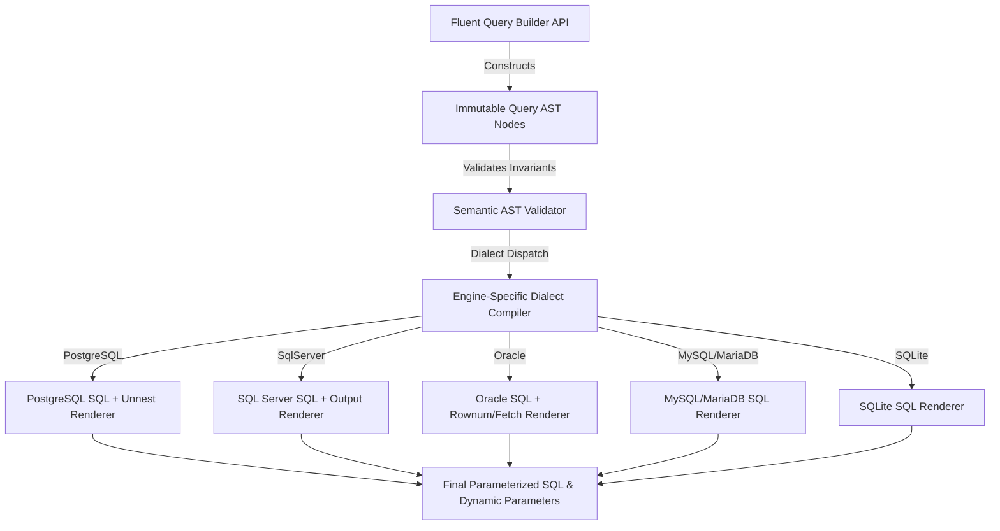

# Level 00: Architectural Introduction & Mental Model

## 1. Overview & Problem Statement
In high-throughput .NET data access layers, generating dynamic SQL queries via string interpolation, reflection-based LINQ query providers, or heavyweight micro-ORMs introduces substantial overhead:
- **Heap Allocations**: String concatenations, LINQ expression tree nodes, and parameter object boxing cause massive Gen 0 garbage collector churn.
- **Dialect Divergence**: Inconsistent syntax across PostgreSQL, SQL Server, MySQL, MariaDB, Oracle, and SQLite requires custom branching or fragmented SQL snippets.
- **Native AOT Hazards**: Reflection-heavy query generators break under Native AOT IL trimming and lack compile-time query syntax guarantees.

`EricksonLopez.SqlBuilder` eliminates these bottlenecks through an **Immutable AST (Abstract Syntax Tree)** and **Zero-Allocation Rendering Pipeline**:
- **Zero Heap Allocations for Static Clauses**: SQL fragments and parameter placeholders are rendered directly into pre-sized `Span<char>` or rented memory buffers.
- **100% Native AOT Compatible**: Strict trimming annotations, zero runtime reflection, and source-generated query binders.
- **Multi-Dialect AST Compilers**: Dedicated SQL dialect engines emit dialect-specific SQL (e.g. `RETURNING` vs `OUTPUT`, `LIMIT/OFFSET` vs `OFFSET...FETCH NEXT`, positional vs named parameters).

---

## 2. AST Query Compilation Flow

---

## 3. High-Level Comparison

| Capability | String Interpolation / Dapper | SqlKata / Linq2db | EricksonLopez.SqlBuilder |
|---|---|---|---|
| **SQL Injection Safety** | Manual parameterization | Automatic parameterization | **Immutable Parameter Bindings (Guaranteed)** |
| **AST Type-Safety** | ❌ No AST (Raw strings) | ⚠️ Mutable Query Objects | ✅ **Strongly Typed Immutable AST Records** |
| **Dialect Portability** | ❌ Hardcoded SQL | ⚠️ Runtime Dialect Lookup | ✅ **Compiled Dialect Strategy Pipelines** |
| **Native AOT Trimmable** | ⚠️ Partial | ❌ Reflection heavy | ✅ **100% Guaranteed & Smoke-Tested** |
| **Heap Allocation Profile** | High string allocations | High AST object churn | **Zero/Near-Zero Allocations via Spans & MemoryPool** |
