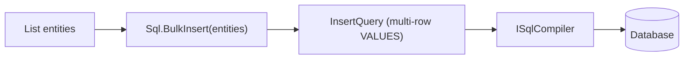

# Level 05: Processing

**Context:** Covers bulk operations, streaming with `IAsyncEnumerable<T>`, AOT-compatible execution, batch deletion, keyset pagination, window-based pagination, and dynamic sorting.

---

## Topics Covered

| # | Feature | API |
|---|---------|-----|
| 1 | BulkInsert | `Sql.BulkInsert<T>(entities)` / `BulkInsertAsync` |
| 2 | Streaming SELECT | `SelectQuery<T>.ToStreamAsync(connection)` |
| 3 | AOT execution | `AotQueryExecutor.QueryAsync<T>` |
| 4 | Batched DELETE | `DeleteQuery<T>.Where(...).ExecuteAsync` in batches |
| 5 | CancellationToken | `QueryAsync(..., CancellationToken)` |
| 6 | Page-based pagination | `Paginate(page, pageSize)` / `QueryPagedAsync<T>` |
| 7 | Offset + Limit | `Limit(n).Offset(skip)` |
| 8 | DELETE with filter | `Sql.Delete<T>().Where(...)` |
| 9 | **SeekAfter** | `SeekAfter(CursorKey[])` — composite forward cursor |
| 10 | **SeekBefore** | `SeekBefore(CursorKey[])` — composite backward cursor |
| 11 | **WindowPage** | `WindowPage(pageNumber, pageSize, orderByColumn, descending)` |
| 12 | **Seek<T>** | `CursorPaginationExtensions.Seek<T>(column, lastValue, asc, limit)` |
| 12 | **OrderByDynamic** | `DynamicSortingExtensions.OrderByDynamic<T>(colName, descending)` |

---

## Keyset Pagination Guide

### Simple Cursor (Seek<T>)
```csharp
// WHERE id > 50 ORDER BY id LIMIT 20
query.Seek(e => e.Id, lastValue: 50, ascending: true, limit: 20)
```

### Composite Cursor (SeekAfter/SeekBefore)
```csharp
// Forward: WHERE (priority > @p0 OR (priority = @p0 AND id > @p1)) LIMIT 10
query.SeekAfter(new CursorKey("priority", 2), new CursorKey("id", 50)).Limit(10)

// Backward: WHERE (priority < @p0 OR (priority = @p0 AND id < @p1)) LIMIT 10
query.SeekBefore(new CursorKey("priority", 2), new CursorKey("id", 50)).Limit(10)
```

### Window Page (ROW_NUMBER-based deep pagination)
```csharp
// Wraps in WITH rn AS (SELECT ROW_NUMBER() OVER (ORDER BY col) ...) WHERE rn BETWEEN...
query.WindowPage(pageNumber: 3, pageSize: 10, "created_at", descending: false)
```

### CursorKey Parameters
```csharp
// CursorKey(string ColumnName, object? Value, bool IsDescending = false)
new CursorKey("id", lastId)                        // ascending
new CursorKey("created_at", lastDate, true)        // descending
```

---

## BulkInsert Pipeline



---

## Reference

**Source:** [`Level05_Processing/ProcessingSample.cs`](../../samples/EricksonLopez.SqlBuilder.Samples/Level05_Processing/ProcessingSample.cs)  
**Requires:** `EricksonLopez.SqlBuilder.Abstractions.Nodes.CursorKey`
