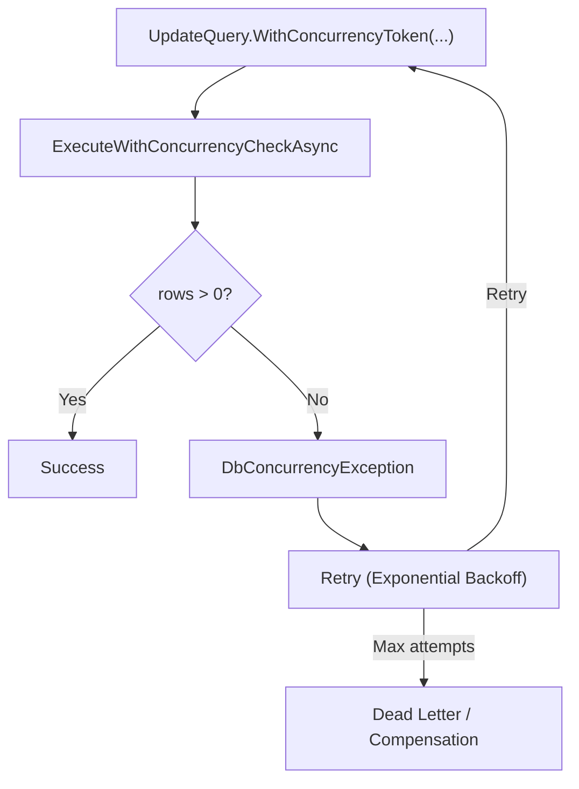

# Level 06: Error Handling

**Context:** Optimistic concurrency, retry strategies, dead-letter patterns, backoff, and resilience.

---

## Topics Covered

| # | Feature | API |
|---|---------|-----|
| 1 | WithConcurrencyToken (auto-increment) | `UpdateQuery<T>.WithConcurrencyToken<TToken>(selector, expectedValue)` |
| 2 | WithConcurrencyToken (explicit new value) | `UpdateQuery<T>.WithConcurrencyToken<TToken>(selector, expected, newValue)` |
| 3 | ExecuteWithConcurrencyCheckAsync | `DapperUpdateExtensions.ExecuteWithConcurrencyCheckAsync<T>(connection)` |
| 4 | DbConcurrencyException | Thrown when version check fails |
| 5 | Polly retry integration | External Polly library + SqlBuilder retry pattern |
| 6 | ExponentialBackoff | Retry with exponential backoff intervals |
| 7 | Dead-letter pattern | Logging and compensating failed operations |
| 8 | Transient vs permanent errors | Distinguishing SqlException error categories |

---

## Concurrency Token Patterns

### Pattern 1: Auto-Increment Version
```csharp
// SQL: SET field = @v WHERE id = @id AND version = @expectedVersion
// Auto-increments version by 1 in the same statement
Sql.Update<Order>()
    .Set(o => o.Status, "shipped")
    .Where(o => o.Id == orderId)
    .WithConcurrencyToken(o => o.Version, expectedVersion: currentVersion)
```

### Pattern 2: Explicit New Value
```csharp
// SQL: SET version = @newVersion WHERE version = @expectedVersion
Sql.Update<Order>()
    .Set(o => o.Status, "processed")
    .Where(o => o.Id == orderId)
    .WithConcurrencyToken(o => o.Version, expectedVersion: v, newValue: Guid.NewGuid())
```

### Concurrency Check Execution
```csharp
var rowsAffected = await connection.ExecuteWithConcurrencyCheckAsync<Order>(query);
if (rowsAffected == 0) throw new DbConcurrencyException("Optimistic concurrency conflict");
```

---

## Error Handling Flow



---

## Reference

**Source:** [`Level06_ErrorHandling/ErrorHandlingSample.cs`](../../samples/EricksonLopez.SqlBuilder.Samples/Level06_ErrorHandling/ErrorHandlingSample.cs)
