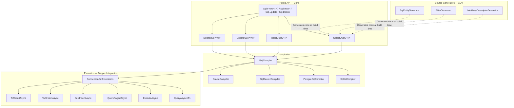
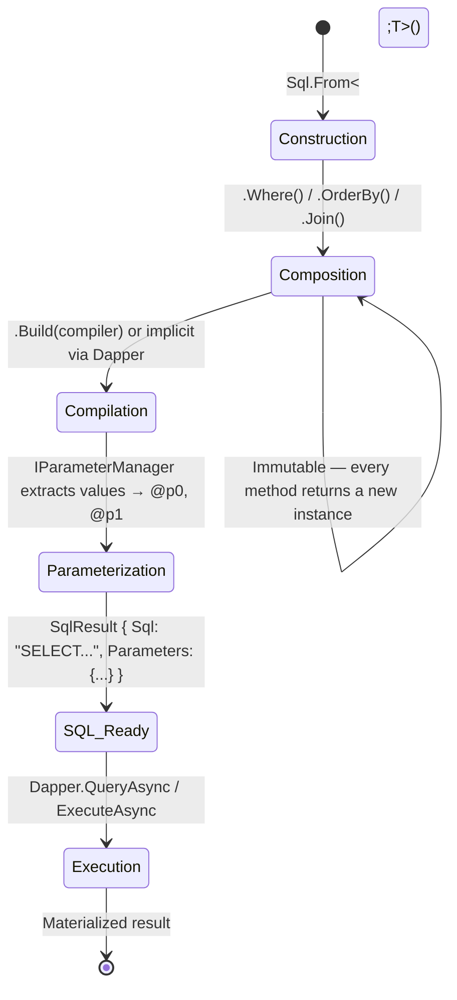
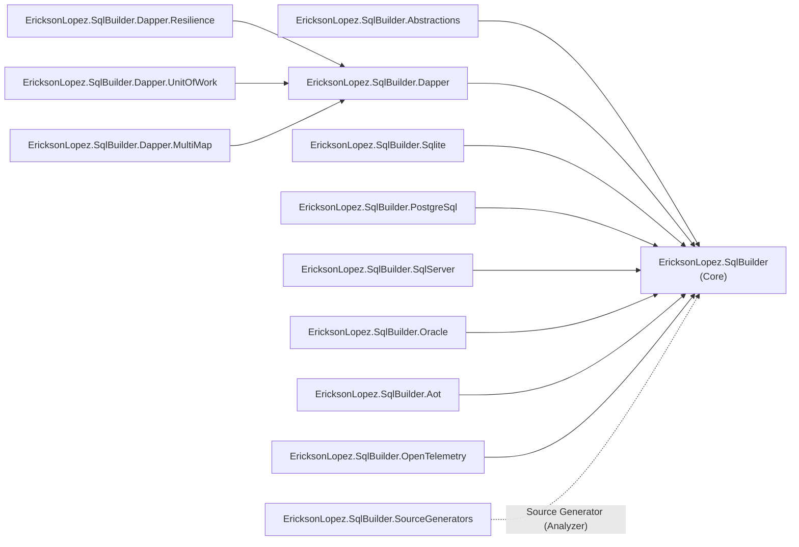
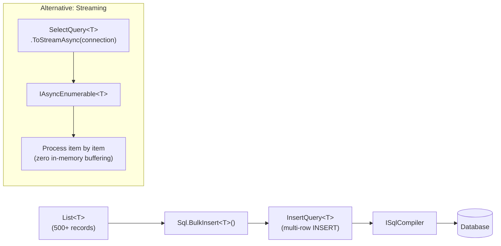
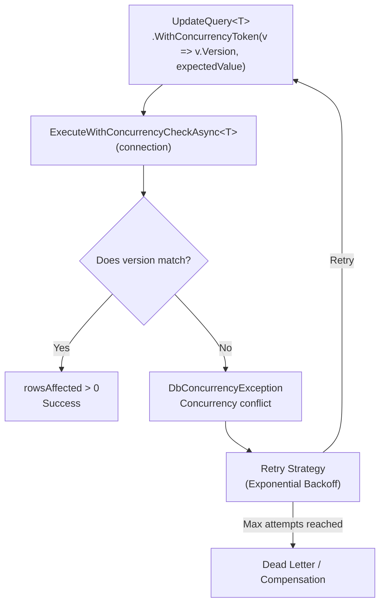
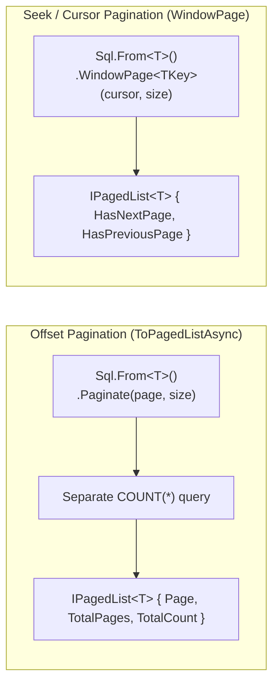

# EricksonLopez.SqlBuilder — Executable Showcase

> **Official executable documentation of the library.**  
> Each level is a complete, compilable sample demonstrating real library APIs.

[](https://github.com/ericksonlopezf/dotnet-sql-builder/actions/workflows/ci.yml)
[](../../LICENSE)
[](https://dotnet.microsoft.com)

---

## Level Index

| Level | Directory | Description |
|-------|-----------|-------------|
| 0 | [`Level00_Conceptual`](Level00_Conceptual/README.md) | What is it? Why does it exist? Comparison with alternatives |
| 1 | [`Level01_QuickStart`](Level01_QuickStart/) | Installation, minimal configuration, first usage |
| 2 | [`Level02_FullConfiguration`](Level02_FullConfiguration/) | Full options, ITypeHandler, serialization |
| 3 | [`Level03_RealUseCases`](Level03_RealUseCases/) | CTE, Window Functions, Merge, Pagination |
| 4 | [`Level04_AdvancedIntegration`](Level04_AdvancedIntegration/) | Joins, SubqueryJoin, CASE, InsertFrom |
| 5 | [`Level05_Processing`](Level05_Processing/) | BulkInsert, Streaming, AOT, Cancellation |
| 6 | [`Level06_ErrorHandling`](Level06_ErrorHandling/) | Concurrency, Retry, Dead-letter, Backoff |
| 7 | [`Level07_Scalability`](Level07_Scalability/) | Cursor pagination, Seek-based, WindowPage |
| 8 | [`Level08_Customization`](Level08_Customization/) | ITypeHandler, IParameterManager, ISqlFilter, ISqlCompiler |
| 9 | [`Level09_Extensions`](Level09_Extensions/README.md) | SqlResult, GetFingerprint, ProjectTo, ToResultAsync, Sql.Raw |
| 10 | [`Level10_EnterpriseArchitecture`](Level10_EnterpriseArchitecture/) | DI, Repository, CQRS, CTE, Multi-Compiler |

---

## High-Level Architecture



---

## Primary Flow

```mermaid
sequenceDiagram
    participant App as Application
    participant Builder as Query Builder<br/>(SelectQuery&lt;T&gt;)
    participant Compiler as ISqlCompiler
    participant Dapper as Dapper Extensions
    participant DB as Database

    App->>Builder: Sql.From&lt;T&gt;().Where(...).OrderBy(...).Limit(10)
    Note over Builder: Builds immutable AST<br/>without executing
    App->>Builder: .Build(compiler) [optional]
    Builder->>Compiler: Compile(ast, paramManager)
    Compiler-->>App: SqlResult { Sql, Parameters }

    App->>Dapper: connection.QueryAsync&lt;T&gt;(query)
    Dapper->>Compiler: Implicitly compiles using registered compiler
    Dapper->>DB: Executes SQL + Parameters
    DB-->>Dapper: DataReader
    Dapper-->>App: IEnumerable&lt;T&gt;
```

---

## Query Lifecycle



---

## Dependency Map



---

## Bulk Processing Pipeline



---

## Error Handling & Concurrency



---

## Pagination: Offset vs Seek



---

## Running the Showcase

```bash
# From repository root
cd samples/EricksonLopez.SqlBuilder.Samples
dotnet run
```

The showcase executes all levels sequentially using SQLite in-memory. No database installation is required.

---

## Relationship with Official Documentation

| This Showcase | Documentation in `/docs/` |
|---------------|---------------------------|
| Level00_Conceptual | [`docs/getting-started.md`](../../docs/getting-started.md) |
| Level01–Level02 | [`docs/api-reference.md`](../../docs/api-reference.md) |
| Level03–Level04 | [`docs/cookbook.md`](../../docs/cookbook.md) |
| Level05–Level07 | [`docs/performance.md`](../../docs/performance.md) |
| Level08 | [`docs/architecture.md`](../../docs/architecture.md) |
| Level09 | [`docs/api-reference.md`](../../docs/api-reference.md) |
| Level10 | [`docs/architecture.md`](../../docs/architecture.md) |

---

> **Note**: This project is the **official reference implementation** of the library.  
> Every public API documented here is extracted directly from the codebase.  
> It contains zero fictional APIs or pseudo-code examples.
